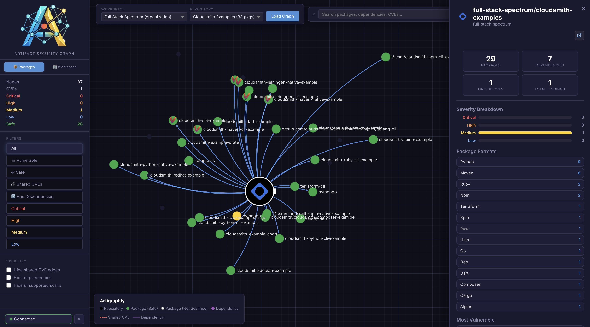
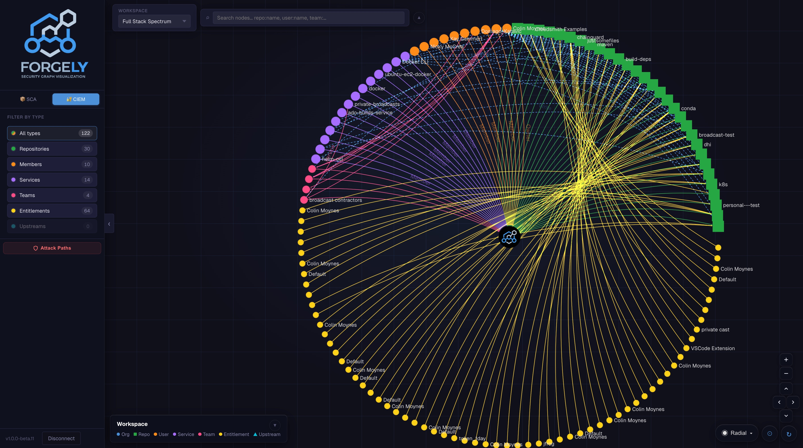
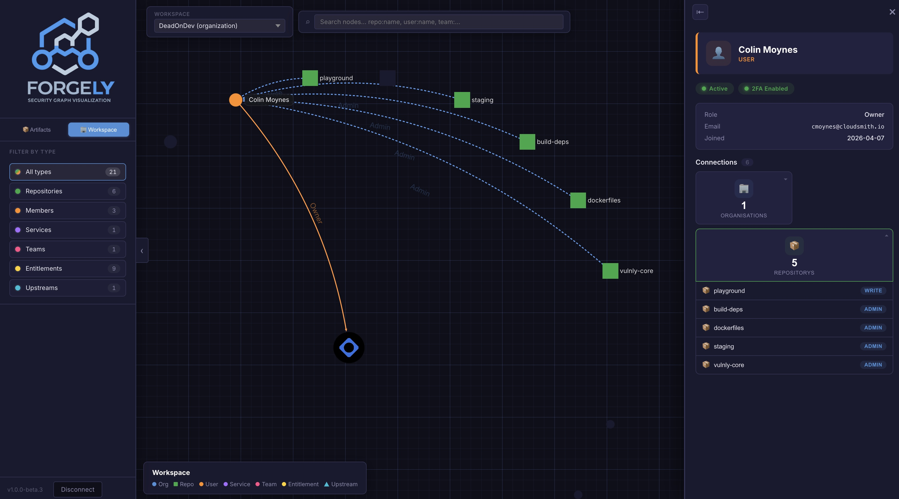

---

> **Disclaimer:** Forgely is a personal, community-driven project. It is **not** an official Cloudsmith product and is not endorsed, supported, or maintained by Cloudsmith.

**Forgely** is a security graph visualization engine for Cloudsmith artifact repositories. It maps packages, dependencies, vulnerabilities, and organisation access structure into interactive, color-coded graphs — helping DevOps and Security teams identify blast radii, transitive risks, and access exposure at a glance.








---

## Architecture

```
┌─────────────────────────────────────────────────────────┐
│  Browser                                                │
│  React + Vite  ──  Sigma.js (WebGL)  ──  graphology     │
└────────────────────────┬────────────────────────────────┘
                         │ /api/*
┌────────────────────────▼────────────────────────────────┐
│  FastAPI  (localhost:8000)                              │
│  In-memory cache · ThreadPoolExecutor (20 workers)      │
└────────────────────────┬────────────────────────────────┘
                         │ HTTPS
┌────────────────────────▼────────────────────────────────┐
│  Cloudsmith API  (api.cloudsmith.io/v1)                 │
└─────────────────────────────────────────────────────────┘
```

| Layer | Stack |
|-------|-------|
| **Frontend** | React 18, TypeScript, Vite, Sigma.js v3 (WebGL), graphology, ForceAtlas2 |
| **Backend** | Python 3.10+, FastAPI, uvicorn, requests, vulnly |
| **Graph rendering** | Sigma.js with custom node programs: images, squares, hexagons, rings |
| **Data source** | Cloudsmith REST API v1 |

---

## Key Features

### Artifact Graph (Packages tab)

- **WebGL rendering** via Sigma.js — smooth 60fps pan/zoom, GPU-accelerated, handles thousands of nodes
- **Severity-coded nodes** — Critical / High / Medium / Low / Safe / Unscanned, each with a distinct colour
- **Pulsing critical nodes** — animated ring effect on Critical packages to draw immediate attention (toggleable)
- **Hover effects** — node glow + size boost; un-hovered edges dim out; connected nodes stay highlighted
- **Quarantine indicators** — quarantined packages rendered with a distinct ring node program
- **Floating details panel** — click any node to open a draggable, repositionable panel anchored near the selected node; expand to full screen for deep inspection
- **CVE detail cards** — per-CVE severity badge, affected/fixed versions, NVD and GitHub Advisory links; paginated (5 collapsed / 15 expanded), with search and severity filter
- **Format cards** — repo overview panel shows package formats with total counts; when a severity filter is active, format cards dim out for formats with no matching packages and show a filtered match count badge
- **Most vulnerable** — top-5 most vulnerable packages listed in the repo panel, clickable to select and navigate directly to that node
- **Dependency graph** — expandable dependencies list within the package panel; click to refocus the graph on a dependency node
- **Attack path panel** — for any package, visualises the full attack chain: Client Tools → Internet → Registry → Repository → Package → CVE, with format-specific client tool examples (docker pull, pip install, npm install, etc.)
- **CVE search** — search by CVE ID or package name; matching nodes are highlighted in the graph
- **Severity filters** — All / Vulnerable / Safe / Critical / High / Medium / Low / Quarantined / Shared CVEs / Has Dependencies
- **Visibility toggles** — show/hide: shared CVE edges, dependency nodes, unscanned packages, critical animation
- **Format filter** — click a format card in the repo panel to isolate packages of that format in the graph
- **Layout switcher** — Force-directed (ForceAtlas2), Circular, Radial, Tree (top-down), Horizontal (left-to-right); edge style auto-switches between curved and straight to match the layout
- **Refresh** — force re-fetch bypasses the cache and pulls fresh data from Cloudsmith

### Organisation Graph (Workspace tab)

- **Org-level access graph** — maps repositories, members, service accounts, teams, entitlements, and upstream proxies as an interconnected graph
- **Node type filtering** — filter by Repositories, Members, Services, Teams, Entitlements, or Upstreams with live counts
- **Prefixed search** — search with type prefixes (`repo:`, `user:`, `service:`, `team:`, `entitlement:`, `upstream:`) or free text
- **Node detail panel** — click any node to see role, email, permissions, status, team memberships, and all connected relationships grouped by edge type

### General

- **Vulnly reports** — generate self-contained HTML vulnerability reports for any scanned package via [vulnly](https://pypi.org/project/vulnly/), opened in a new tab
- **Workspace selector** — switch between Cloudsmith organisations; repository selector with per-namespace package counts
- **API key management** — connect/disconnect via in-app modal; key validated against the Cloudsmith API before saving
- **Panel collapse** — left control panel can be fully collapsed for more graph space
- **Version string** — panel header shows truncated version with full tooltip and one-click copy to clipboard
- **Dark security-product theme** — graph-paper grid background, glassmorphism toolbars, custom scrollbars

---

## 🚀 Quick Start

### Prerequisites

- **Python 3.10+** — [python.org](https://www.python.org/downloads/)
- **Node.js 18+** and **npm** — [nodejs.org](https://nodejs.org/)
- A **Cloudsmith API key** — [Generate one here](https://app.cloudsmith.com/user/settings/api/)

### 1. Clone

```bash
git clone https://github.com/your-user/Forgely.git
cd Forgely
```

### 2. Run

```bash
./start.sh
```

The start script creates the Python virtual environment, installs all dependencies, and launches both servers:

- Backend → **http://localhost:8000**
- Frontend → **http://localhost:3000**

Press `Ctrl+C` to stop both servers.

<details>
<summary>Manual start</summary>

```bash
# Terminal 1 — Backend
cd backend
python3 -m venv .venv && source .venv/bin/activate
pip install -r requirements.txt
uvicorn main:app --port 8000

# Terminal 2 — Frontend
cd frontend
npm install
npm run dev
```

</details>

---

## ⚙️ Configuration

| Variable | Required | Description |
|----------|----------|-------------|
| `CLOUDSMITH_API_KEY` | Yes* | Cloudsmith API key (*can also be set via the in-app Connect modal) |
| `CLOUDSMITH_OWNER` | No | Default organisation slug (pre-populates the workspace selector) |
| `CLOUDSMITH_REPO` | No | Default repository slug (pre-populates the repo selector) |
| `CORS_ORIGINS` | No | Comma-separated allowed CORS origins (default: `http://localhost:3000`) |

---

## API Endpoints

| Endpoint | Method | Description |
|----------|--------|-------------|
| `/api/health` | GET | Health check |
| `/api/config` | GET | Returns configured owner, repo, and key status |
| `/api/namespaces` | GET | List Cloudsmith workspaces the key has access to |
| `/api/repos/{owner}` | GET | List repositories for a workspace |
| `/api/graph` | GET | Artifact graph data for `?owner=&repo=` (5 min cache) |
| `/api/graph/refresh` | POST | Force re-fetch, bypassing cache |
| `/api/search` | GET | Search packages by name/version/format |
| `/api/org-graph` | GET | Organisation access graph for `?owner=` |
| `/api/auth/validate` | POST | Validate a Cloudsmith API key |
| `/api/vulnly-report/{owner}/{repo}/{slug}` | GET | Generate HTML vulnerability report via [vulnly](https://pypi.org/project/vulnly/) |

---

## 🎨 Severity Colour Key

| Colour | Severity |
|--------|----------|
| 🔴 `#ff4d4d` | Critical |
| 🟠 `#ff8c1a` | High |
| 🟡 `#ffd11a` | Medium |
| 🔵 `#79b8ff` | Low |
| 🟢 `#28a745` | Safe — no vulnerabilities detected |
| ⚫ `#666666` | Unscanned — external or unscanned dependency |
| 🟣 `#9b59b6` | Dependency — grouped dependency node |

---

## 🗺️ Layout Modes

| Layout | Description |
|--------|-------------|
| 💥 Force | ForceAtlas2 — organic clustering by connection gravity |
| ◎ Circular | All nodes arranged in a circle |
| 🎯 Radial | Repository pinned to centre, packages orbit outward |
| 🌳 Tree | Hierarchical top-down — repo → packages → dependencies |
| ↔ Horizontal | Left-to-right tree layout |

---

## 📂 Project Structure

```
Forgely/
├── backend/
│   ├── main.py               # FastAPI app, graph construction, caching
│   ├── cloudsmith.py         # Cloudsmith API client (packages, vulns, deps, org)
│   ├── models.py             # Pydantic response models
│   └── requirements.txt      # Python dependencies
├── frontend/
│   ├── public/               # Static assets (icons, logos)
│   └── src/
│       ├── components/
│       │   ├── GraphCanvas.tsx        # Artifact graph (Sigma.js WebGL)
│       │   ├── OrgGraphCanvas.tsx     # Organisation graph (Sigma.js WebGL)
│       │   ├── SidePanel.tsx          # Package / repo / dependency detail panel
│       │   ├── OrgSidePanel.tsx       # Organisation node detail panel
│       │   ├── AttackGraphPanel.tsx   # Attack path visualisation
│       │   ├── FilterBar.tsx          # Left control panel (artifacts tab)
│       │   ├── OrgLeftPanel.tsx       # Left control panel (workspace tab)
│       │   ├── SearchBar.tsx          # Package / CVE search
│       │   ├── OrgSearchBar.tsx       # Organisation node search
│       │   ├── RepoSelector.tsx       # Workspace + repository selector
│       │   ├── WorkspaceSelector.tsx  # Organisation selector
│       │   ├── Legend.tsx             # Artifact graph legend
│       │   ├── OrgLegend.tsx          # Organisation graph legend
│       │   ├── ConnectModal.tsx       # API key connect/disconnect modal
│       │   └── LoadingIndicator.tsx   # Animated multi-stage loading screen
│       ├── hooks/
│       │   └── useGraphData.ts        # Data fetching and state for artifact graph
│       ├── lib/
│       │   ├── auth.ts                # API key storage and fetch wrapper
│       │   └── formatIcons.ts         # Package format → Devicon icon URL map
│       ├── types/
│       │   └── index.ts               # TypeScript types and constants
│       ├── App.tsx                    # Root component, tab routing, panel state
│       ├── main.tsx                   # Entry point
│       └── index.css                  # Global styles
│   ├── package.json
│   └── vite.config.ts
├── .claude/
│   └── commands/
│       └── commit-msg.md             # /commit-msg Claude Code skill
├── start.sh                          # Start script (backend + frontend)
├── .env                              # Credentials (not committed)
├── assets/
│   └── readme/                       # README screenshots
├── CHANGELOG.md
├── LICENSE
└── README.md
```

---

## License

See [LICENSE](LICENSE).
