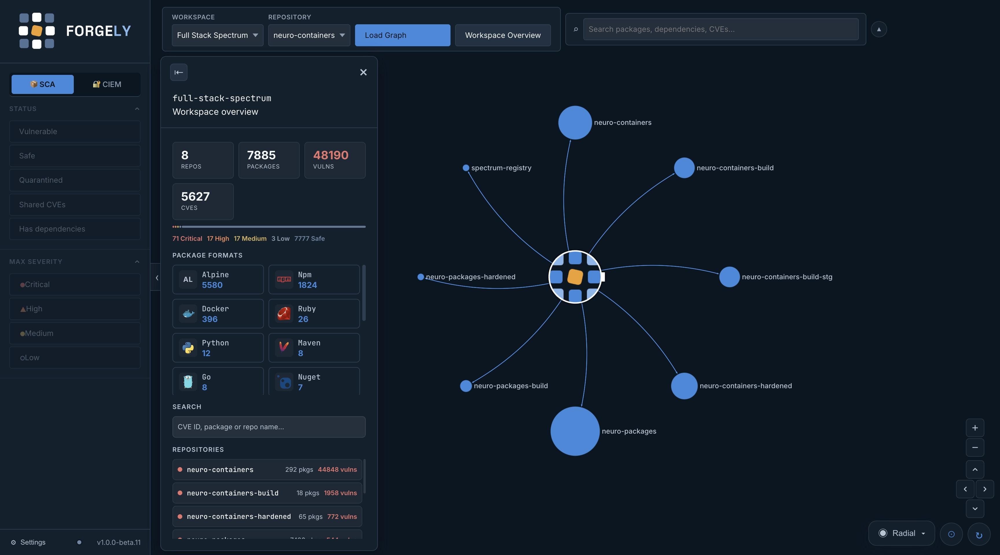
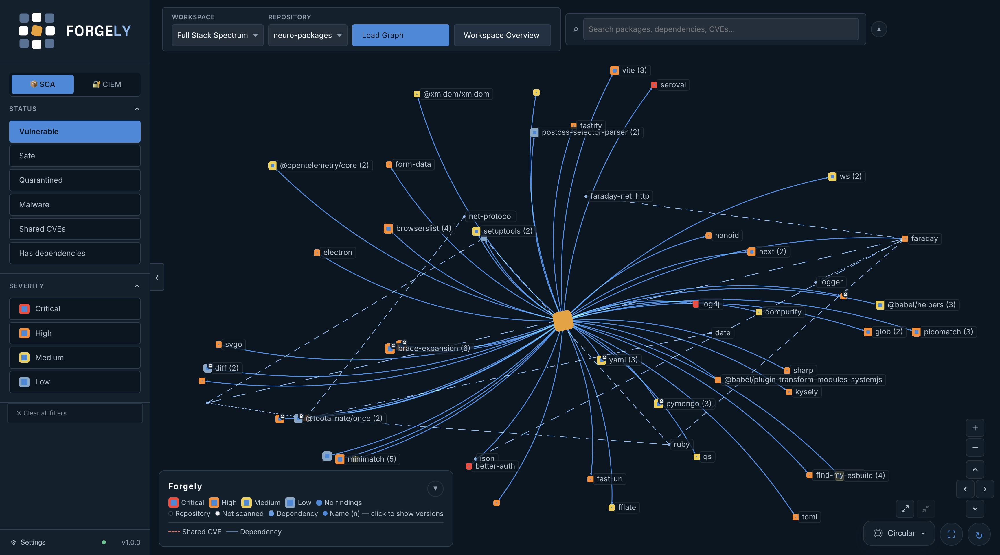
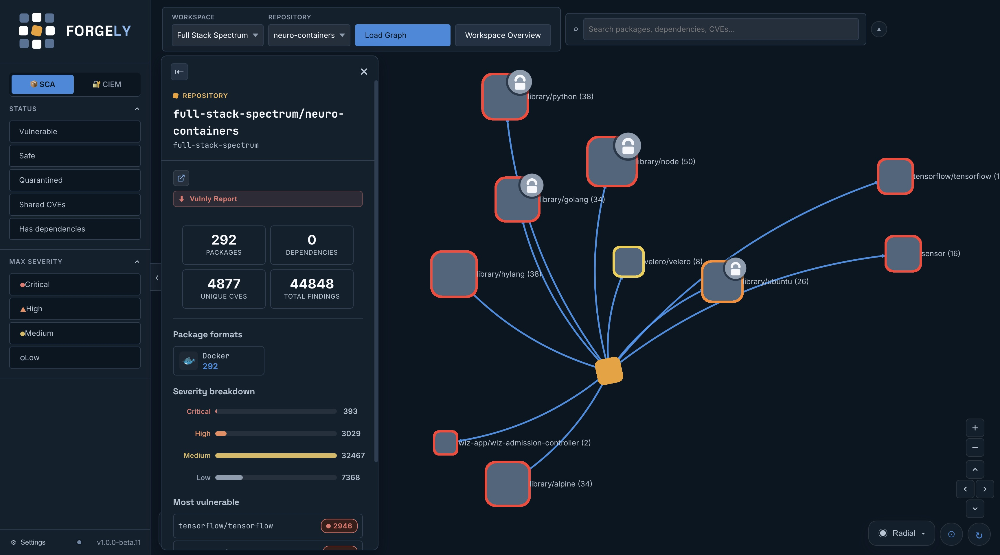
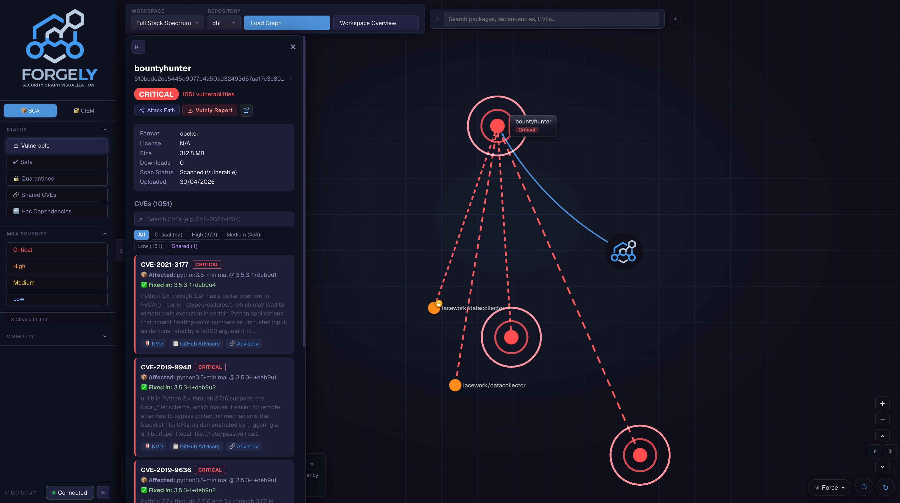
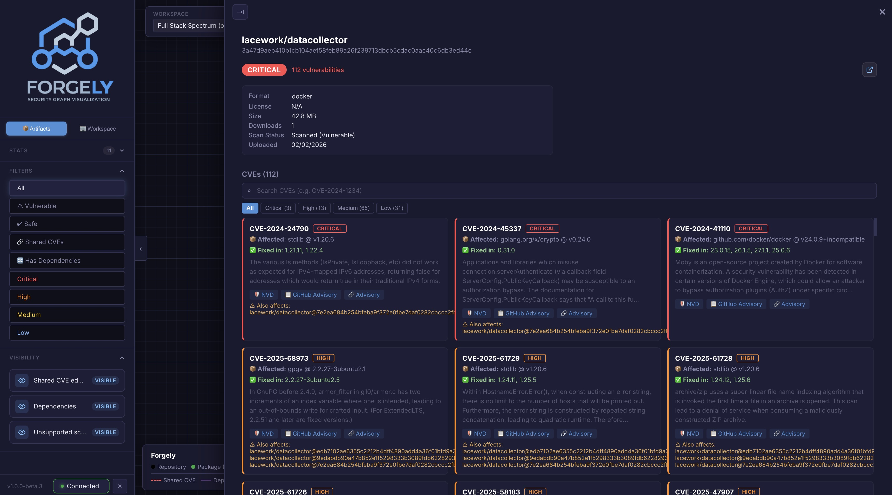
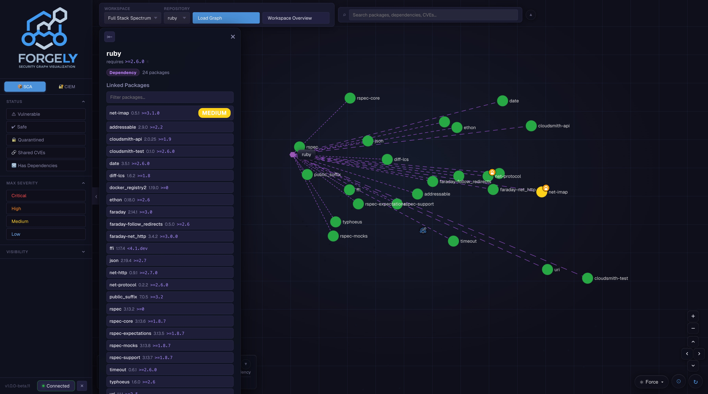
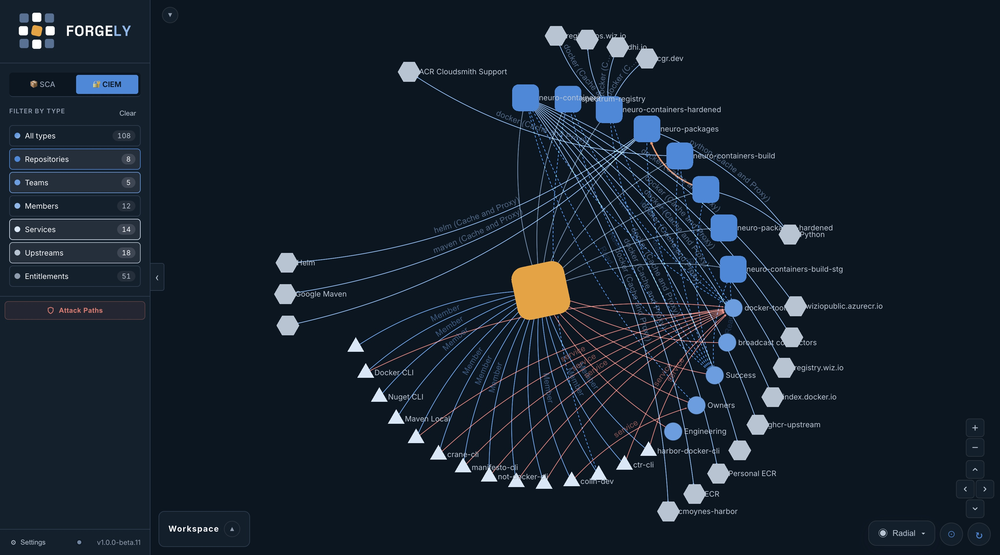
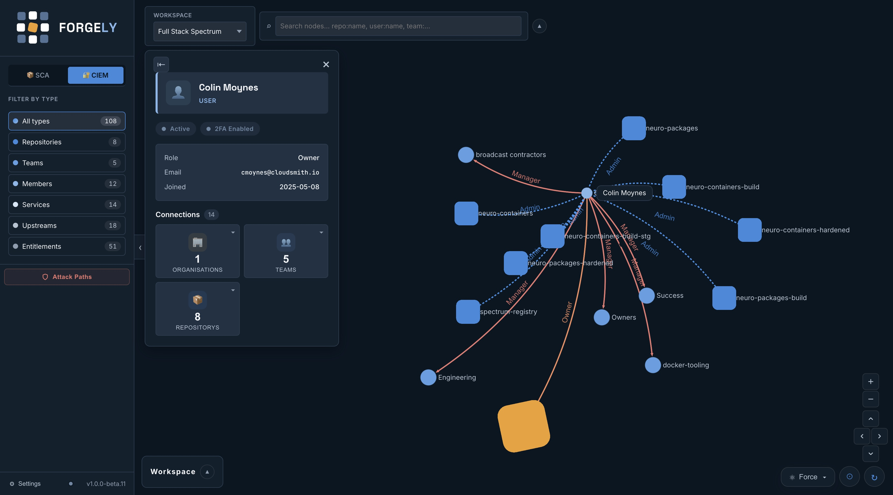
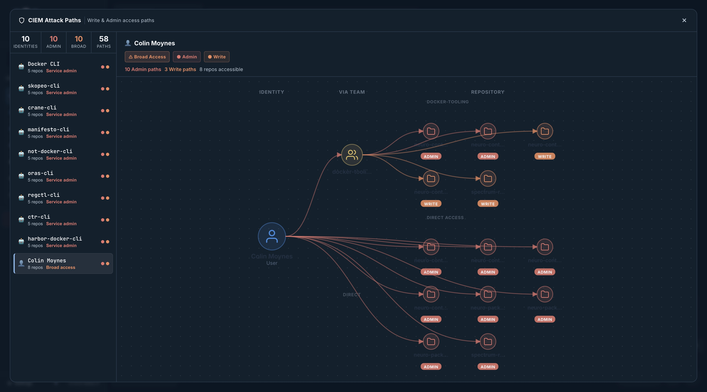

<picture>
  <source media="(prefers-color-scheme: dark)" srcset="assets/readme/forgely-lockup-reversed.svg">
  
</picture>

**From artifact to blast radius.**

---

> [!CAUTION]
> This project is an independent, community-developed tool and is **not** affiliated with, endorsed by, or supported by Cloudsmith Ltd. It is provided "as is", without warranty of any kind. Cloudsmith Ltd. accepts no responsibility or liability for any loss, damage, or issues arising from the use of this tool. Use at your own risk.

> [!NOTE]
> **Built with AI assistance.** Forgely was vibe coded with [Claude](https://claude.com/claude-code) — a large share of the code here was written by an AI assistant working from prompts, then reviewed and directed by a human. Treat it as you would any code you did not write line by line: read it before you run it against anything you care about.

**Forgely** is a security graph visualization engine for Cloudsmith artifact repositories. It covers two core cloud-native security disciplines — **SCA** and **CIEM** — surfacing them as interactive, colour-coded graphs so DevOps and Security teams can identify blast radii, transitive risks, and access exposure at a glance.

Runs as a single container — the backend serves the frontend, so there is one
image, one port and no CORS to configure:

```bash
docker run -d -p 8000:8000 -v forgely-cache:/data fullstackspectrum/forgely:latest
```

See [Quick Start](#-quick-start) for compose, building it yourself, or running
from source.


Workspace overview



Repository graph


Repository graph details


Package details


Package Attack Path


Dependancy tracking


CIEM graph


CIEM user


CIEM attack path


---

## Security Domains

### SCA — Software Composition Analysis

SCA is the practice of scanning open-source and third-party package dependencies for known vulnerabilities (CVEs). It is a foundational pillar of software supply chain security.

Forgely's SCA view answers:
- Which packages across my repositories contain known CVEs?
- What is the blast radius of a specific vulnerability — which dependent packages are transitively exposed?
- Which packages are quarantined, and why?
- What does the full attack path look like from a client tool to a CVE?

### CIEM — Cloud Infrastructure Entitlement Management

CIEM focuses on governing *who has access to what* in cloud and SaaS environments. Excessive or misconfigured entitlements are a leading cause of cloud security incidents.

Forgely's CIEM view answers:
- Which members, service accounts, and teams have access to which repositories?
- What entitlements and upstream proxies are in use?
- Are there unexpected or over-privileged access paths between identities and resources?
- How are teams structured, and what do their combined access rights look like?

### Together

| Domain | What it protects | Key question |
|--------|-----------------|--------------|
| **SCA** | Software supply chain | What vulnerable components am I running? |
| **CIEM** | Identity & access surface | Who can reach those components — and should they? |

Combining SCA and CIEM in a single tool means you can cross-reference a vulnerable package with the identities that have write or download access to the repository that hosts it — a critical step in assessing actual exploitability and impact.

---

## Architecture

```
┌─────────────────────────────────────────────────────────┐
│  Browser                                                │
│  React + Vite  ──  Sigma.js (WebGL)  ──  graphology     │
└────────────────────────┬────────────────────────────────┘
                         │ /api/*  (same origin in the container,
                         │          proxied from :3000 in development)
┌────────────────────────▼────────────────────────────────┐
│  FastAPI  (localhost:8000)                              │
│  In-memory + SQLite scan cache · ThreadPoolExecutor      │
└────────────────────────┬────────────────────────────────┘
                         │ HTTPS
┌────────────────────────▼────────────────────────────────┐
│  Cloudsmith API  (api.cloudsmith.io/v1)                 │
└─────────────────────────────────────────────────────────┘
```

| Layer | Stack |
|-------|-------|
| **Frontend** | React 18, TypeScript, Vite, Sigma.js v3 (WebGL), graphology, ForceAtlas2 |
| **Backend** | Python 3.10+, FastAPI, uvicorn, requests, vulnly |
| **Graph rendering** | Sigma.js with custom node programs: images, squares, hexagons, rings |
| **Data source** | Cloudsmith REST API v1 |

---

## Key Features

### SCA — Software Composition Analysis

- **WebGL rendering** via Sigma.js — smooth 60fps pan/zoom, GPU-accelerated, handles thousands of nodes
- **Severity-coded nodes** — Critical / High / Medium / Low / Safe / Unscanned, each with a distinct colour
- **Pulsing critical nodes** — animated ring effect on Critical packages to draw immediate attention (toggleable)
- **Hover effects** — node glow + size boost; un-hovered edges dim out; connected nodes stay highlighted
- **Quarantine indicators** — quarantined packages rendered with a distinct ring node program, drawn above the selection ring rather than behind it
- **Malware detection** — a status filter, a node indicator that also surfaces on the group containing the package, and an optional pulse animation. Malware takes precedence over Critical wherever both would claim the same node; an expanded group pulses on its child versions only, not on the open hub as well
- **Hover tooltips** — package format and, for container images, architecture, on plated labels that stay legible against node imagery in either theme
- **Docked details panel** — click any node to open a full-height panel on the right; the graph and top bar make room for it rather than being covered. Expand to full screen for deep inspection, where the CVE and dependency lists reflow into columns
- **Panel tabs** — a package splits across Details, Vulnerabilities, Dependencies and Reachability. The Dependencies tab appears only when dependency data exists, since not every format reports it
- **CVE detail cards** — per-CVE severity badge, affected/fixed versions, NVD and GitHub Advisory links; paginated with search and severity filter
- **Format cards** — repo overview panel shows package formats with total counts; format cards dim when a severity filter is active
- **Most vulnerable** — top-5 most vulnerable packages listed in the repo panel, clickable to navigate directly to that node
- **Dependency graph** — expandable dependencies list within the package panel; click to refocus on a dependency node
- **Fit graph** — centres on the repository and zooms out until every node is on screen
- **Attack path panel** — visualises the full attack chain: Client Tools → Internet → Registry → Repository → Package → CVE, with format-specific client tool examples
- **Version grouping** — packages sharing a name collapse to one node carrying the group's worst severity (292 nodes to 15 on a container repo). Click a group to inspect it, double-click to open it in the graph, or expand/collapse every group at once from the graph controls
- **Group details panel** — a group's panel lists every version worst-first with its severity, type, architecture and tags, searchable by tag — which matters for Docker, where the version is a digest and the tag is the only readable part
- **Package metadata** — digests (click to copy), format-specific identifiers, tags, uploader, filename, architecture and distribution, fetched on selection so the graph payload stays small
- **CVE search** — search by CVE ID or package name; matching nodes are highlighted in the graph
- **Severity filter** — Critical / High / Medium / Low, multi-select: pick Critical *and* High to see both. No selection means every severity
- **Status filters** — Vulnerable / Safe / Quarantined / Malware / Shared CVEs / Has dependencies, combined with AND or OR. "Safe" means *scanned and clean*, not merely "no findings recorded", so packages whose format cannot be scanned are excluded
- **Visibility toggles** — show/hide: shared CVE edges, dependency nodes, unscanned packages, critical animation, malware animation
- **Format filter** — click a format card in the repo panel to isolate packages of that format in the graph
- **Workspace overview** — cross-repository SCA view: all repos in an organisation rendered as a single graph, with aggregate vulnerability stats, package format heatmap, severity breakdown, and cross-repo CVE search
- **Layout switcher** — Force-directed (ForceAtlas2), Circular, Radial, Tree, Horizontal; edge style auto-switches to match layout
- **Viewport-filling layout** — the initial scatter is stretched to the container's aspect ratio and spread by golden angle, so a wide window is used rather than letterboxed and no run of related packages lands in one arc
- **Density scaling** — on a large repository, node sizes are scaled down against the space available, which is what browser zoom-out was being used for
- **Refresh** — force re-fetch bypasses the cache and pulls fresh data from Cloudsmith

### Linking SCA and CIEM

- **Exposure summary** — the package panel answers *who can reach this artifact*, without switching graphs and rebuilding a different one
- **Reachability tab** — access data loads with its own spinner, so a slow lookup never holds up the vulnerability data next to it
- **Jump to CIEM** — open the identity graph focused on the repository hosting a package, straight from that package
- **Per-repository fetch** — access is keyed on the repository rather than the package, so clicking between packages in one repo is a single request

### CIEM — Cloud Infrastructure Entitlement Management

- **Identity graph** — maps repositories, members, service accounts, teams, entitlements, and upstream proxies as an interconnected graph
- **Node type filtering** — filter by Repositories, Members, Services, Teams, Entitlements, or Upstreams with live counts
- **Prefixed search** — search with type prefixes (`repo:`, `user:`, `service:`, `team:`, `entitlement:`, `upstream:`) or free text
- **Node detail panel** — click any node to see role, email, permissions, status, team memberships, and all connected relationships grouped by edge type
- **Access path visibility** — entitlement and access edges are rendered as dashed curves to distinguish them from structural relationships
- **Connected repositories** — Cloudsmith's repository connections drawn as a distinct directional edge in both the workspace overview and the identity graph, and listed in the repository panel

### General

- **Vulnly reports** — generate self-contained HTML vulnerability reports for any scanned package via [vulnly](https://pypi.org/project/vulnly/), opened in a new tab
- **Workspace selector** — switch between Cloudsmith organisations; repository selector with per-namespace package counts
- **API key management** — a Connection tab in Settings, not a separate dialog; shows the authorised user for the current credential, and validates the key against the Cloudsmith API before saving. Stored in the browser, never in the image
- **Panel collapse** — left control panel can be fully collapsed for more graph space
- **Version string** — panel header shows truncated version with full tooltip and one-click copy to clipboard
- **Dark security-product theme** — graph-paper grid background, glassmorphism toolbars, custom scrollbars

---

## 🚀 Quick Start

### Run the container

Nothing to clone, no toolchain to install — just Docker.

```bash
docker run -d \
  --name forgely \
  -p 8000:8000 \
  -v forgely-cache:/data \
  fullstackspectrum/forgely:latest
```

Open **http://localhost:8000** and add your Cloudsmith API key under
**Settings → Connection**. The key is stored in your browser, not in the image.
[Generate one here](https://app.cloudsmith.com/user/settings/api/).

Or with compose:

```yaml
services:
  forgely:
    image: fullstackspectrum/forgely:latest
    ports:
      - "8000:8000"
    volumes:
      - forgely-cache:/data
    restart: unless-stopped

volumes:
  forgely-cache:
```

> [!IMPORTANT]
> `-p 8000:8000` is required. Without it the container starts and reports
> healthy but nothing reaches it — and if a local dev server is already on port
> 8000, you will be talking to that instead.

**Platforms:** `linux/amd64` and `linux/arm64`. Windows is covered by
`linux/amd64`, since Docker Desktop runs Linux containers through WSL2.

The image serves the frontend and the API from one origin, so there is no CORS
to configure and no second container to run. Mount `/data` to keep the scan
cache between runs: it is keyed on each package's scan completion time rather
than a TTL, so a warm cache turns a cold build of several thousand packages
into a local read.

<details>
<summary><b>Build the image yourself</b></summary>

```bash
./bump-version.sh                            # 1.0.0-beta.11 -> 1.0.0-beta.12
./bump-version.sh minor --tag --changelog    # release, tag it, start a changelog entry
./bump-version.sh --help                     # all options
```

`frontend/package.json` is the single source of truth for the version: the
footer reads it, the backend sends it as its User-Agent, and the image tag
comes from it, so one bump keeps all three in step.

```bash
./build-image.sh                             # build and load locally
./build-image.sh --push                      # multi-arch, push to Docker Hub
./build-image.sh --push -r ghcr.io/your-org  # somewhere else
./build-image.sh --help                      # all options
```

The tag comes from `frontend/package.json`, so it cannot drift from the version
the app reports in its own footer. OCI annotations (source, revision, licence,
created) are attached as both annotations and labels — registry UIs read the
former, `docker inspect` reads the latter.

The image is built on [Chainguard](https://www.chainguard.dev/) bases and scans
clean:

```
$ trivy image fullstackspectrum/forgely
Total: 0 (CRITICAL: 0, HIGH: 0, MEDIUM: 0, LOW: 0)
```

The runtime stage is distroless — no shell, no package manager — so
`docker exec … sh` will not work. Use `docker logs`, or build against
`cgr.dev/chainguard/python:latest-dev` if you need to look around inside.

> [!NOTE]
> Chainguard's free tier publishes only `:latest`, which tracks the newest
> Python rather than a pinned minor version. If you need the interpreter held
> still, `python:3.12-alpine` is the next best base — 0 critical and 0 high,
> 5 medium, and it keeps a shell.

</details>

---

### Run from source

For development, where Vite serves the frontend with hot reload and proxies
`/api` to the backend.

**Prerequisites**

- **Python 3.10+** — [python.org](https://www.python.org/downloads/)
- **Node.js 18+** and **npm** — [nodejs.org](https://nodejs.org/)
- A **Cloudsmith API key** — [Generate one here](https://app.cloudsmith.com/user/settings/api/)

```bash
git clone https://github.com/colinmoynes/Forgely.git
cd Forgely
./start.sh
```

`start.sh` creates the Python virtual environment, installs all dependencies,
and launches both servers:

- Backend → **http://localhost:8000**
- Frontend → **http://localhost:3000**

Press `Ctrl+C` to stop both.

<details>
<summary>Manual start</summary>

```bash
# Terminal 1 — Backend
cd backend
python3 -m venv .venv && source .venv/bin/activate
pip install -r requirements.txt
uvicorn main:app --port 8000

# Terminal 2 — Frontend
cd frontend
npm install
npm run dev
```

</details>

---

## ⚙️ Configuration

| Variable | Required | Description |
|----------|----------|-------------|
| `CLOUDSMITH_API_KEY` | Yes* | Cloudsmith API key (*can also be set via the in-app Connect modal) |
| `CLOUDSMITH_OWNER` | No | Default organisation slug (pre-populates the workspace selector) |
| `CLOUDSMITH_REPO` | No | Default repository slug (pre-populates the repo selector) |
| `CORS_ORIGINS` | No | Comma-separated allowed CORS origins (default: `http://localhost:3000`). Not needed in the container, where one origin serves both |
| `FORGELY_CACHE_PATH` | No | Where the scan cache lives (container default: `/data/scans.db`) |
| `FORGELY_STATIC_DIR` | No | Built frontend to serve. Set in the image; unset in development, where Vite serves it |

---

## API Endpoints

| Endpoint | Method | Description |
|----------|--------|-------------|
| `/api/health` | GET | Health check |
| `/api/config` | GET | Returns configured owner, repo, and key status |
| `/api/namespaces` | GET | List Cloudsmith workspaces the key has access to |
| `/api/repos/{owner}` | GET | List repositories for a workspace |
| `/api/graph` | GET | SCA artifact graph for `?owner=&repo=` (5 min cache) |
| `/api/graph/stream` | GET | Same graph as server-sent events, with build progress |
| `/api/graph/refresh` | POST | Force re-fetch, bypassing cache |
| `/api/cve/{owner}/{repo}/{slug}` | GET | Full CVE records for one package, descriptions included |
| `/api/package/{owner}/{repo}/{slug}` | GET | Full metadata for one package: digests, tags, identifiers |
| `/api/package-group/{owner}/{repo}` | GET | Every version published under `?name=` |
| `/api/repo-access/{owner}/{repo}` | GET | Identities, teams and entitlements that can reach a repository — the SCA/CIEM join |
| `/api/search` | GET | Search packages by name/version/format |
| `/api/changelog` | GET | CHANGELOG.md, rendered in the version modal |
| `/api/workspace-overview` | GET | Cross-repo SCA overview for `?owner=` (10 min cache) |
| `/api/org-graph` | GET | CIEM identity graph for `?owner=` |
| `/api/auth/validate` | POST | Validate a Cloudsmith API key |
| `/api/vulnly-report/{owner}/{repo}/{slug}` | GET | Generate HTML vulnerability report via [vulnly](https://pypi.org/project/vulnly/) |
| `/api/vulnly-repo-report/{owner}/{repo}` | GET | Same report across a whole repository |

The three per-package endpoints are fetched on selection rather than inlined in
the graph. CVE descriptions alone were 21.5 MB of a 29.2 MB payload, and none of
it is visible until a node is clicked.

---

## Reading the graph

The graph uses the same vocabulary as the mark: a grid of rounded squares
around one displaced ember cell.

| Node | Meaning |
|------|---------|
| Ember square, tilted | The repository — the centre everything is arranged around. The workspace overview uses the same mark for the workspace |
| Blue square | A package. The shade is its distance from whatever you have selected |
| Blue square, tilted | The package you are currently investigating, or the one under the pointer |
| Blue square, labelled `name (n)` | A group: every version published under one name, sized by how many |
| Hexagon | A dependency |

**Fill encodes distance, not severity.** Selecting a package shades the graph by
how far each node is from it — direct, two hops, three, then everything beyond.
Containment edges are not traversed: reaching another package *through* the
repository is not blast radius. Nodes it cannot reach fade back rather than
changing colour, so the distance encoding survives the dimming.

**Severity is a ring around the node, in one width for every level.** The ring
used to widen with severity — 6/4/2.5/1.5px — to survive a greyscale screenshot,
which the ramp alone does not: desaturated, Critical and Low land three levels
apart out of 255. But at 6px a Critical ring read as a *different kind of node*
rather than a worse one, so the width is now uniform and the greyscale criterion
is met away from the canvas, where severity is also a distinct shape.

| Level | Ring | Panel mark | Light | Dark |
|-------|------|------------|-------|------|
| Critical | 4px | ● filled circle | `#D62B20` | `#FF3B30` |
| High | 4px | ▲ filled triangle | `#C25E00` | `#FF8A1F` |
| Medium | 4px | ■ filled square | `#8A6410` | `#F2CE3F` |
| Low | 4px | ○ hollow circle | `#4E657D` | `#7FA8C9` |
| None | none | □ hollow square | — | — |

The **panel mark** is what dense lists use, where shape carries the level
without relying on colour. The legend and the severity filters instead show a
package node with its ring, so the key matches the thing it is keying — ring
width and colour there are read from the same constants the renderer uses, so
they cannot drift from the canvas.

Graph rings are more saturated than the severity colours used in text and
badges: a ring is a non-text element, so it is held to 3:1 rather than 4.5:1
and can be far better separated. Text severities use the muted ramp.

Both themes are supported — Light, Auto and Dark, in the sidebar footer. Auto
follows the system setting.

---

## 🗺️ Layout Modes

| Layout | Description |
|--------|-------------|
| 💥 Force | ForceAtlas2 — organic clustering by connection gravity. On a repository whose edges nearly all hang off the repo node, the graph is already at equilibrium and the settling step stops early rather than spending the budget moving nothing |
| ◎ Circular | All nodes arranged in a circle |
| 🎯 Radial | Repository / workspace pinned to centre, nodes orbit outward |
| 🌳 Tree | Hierarchical top-down |
| ↔ Horizontal | Left-to-right tree layout |

---

## 📂 Project Structure

```
Forgely/
├── backend/
│   ├── main.py               # FastAPI app, graph construction, caching
│   ├── cloudsmith.py         # Cloudsmith API client (packages, vulns, deps, org)
│   ├── models.py             # Pydantic response models
│   ├── cache.py              # Persistent scan cache (SQLite), keyed on scan time
│   ├── compression.py        # Streaming gzip for the graph responses
│   ├── perfstats.py          # Per-build request timing and cache instrumentation
│   └── requirements.txt      # Python dependencies
├── frontend/
│   ├── public/               # Brand SVGs and self-hosted fonts
│   └── src/
│       ├── components/
│       │   ├── GraphCanvas.tsx              # SCA artifact graph (Sigma.js WebGL)
│       │   ├── OrgGraphCanvas.tsx           # CIEM identity graph (Sigma.js WebGL)
│       │   ├── WorkspaceOverviewCanvas.tsx  # Cross-repo SCA overview graph
│       │   ├── SidePanel.tsx                # Routes a selection to one of the panels below
│       │   ├── panels/
│       │   │   ├── PackagePanel.tsx         # Details / vulns / deps / reachability tabs
│       │   │   ├── GroupPanel.tsx           # Every version behind a grouped node
│       │   │   ├── DependencyPanel.tsx      # Transitive dependency detail
│       │   │   ├── RepoPanel.tsx            # Repository summary, formats, most vulnerable
│       │   │   └── shared.tsx               # Pieces the four panels have in common
│       │   ├── OrgSidePanel.tsx             # CIEM node detail panel
│       │   ├── WorkspaceOverviewPanel.tsx   # Workspace-level SCA summary panel
│       │   ├── WorkspaceRepoPanel.tsx       # Per-repo SCA detail panel (overview mode)
│       │   ├── AttackGraphPanel.tsx         # SCA attack path visualisation
│       │   ├── CiemAttackPathPanel.tsx      # CIEM attack path visualisation
│       │   ├── FilterBar.tsx                # Left control panel (SCA tab)
│       │   ├── OrgLeftPanel.tsx             # Left control panel (CIEM tab)
│       │   ├── LayoutPopout.tsx             # Shared layout/edge style control
│       │   ├── SearchBar.tsx                # Package / CVE search
│       │   ├── OrgSearchBar.tsx             # CIEM node search
│       │   ├── RepoSelector.tsx             # Workspace + repository selector
│       │   ├── WorkspaceSelector.tsx        # Organisation selector
│       │   ├── Legend.tsx                   # SCA graph legend
│       │   ├── OrgLegend.tsx                # CIEM graph legend
│       │   ├── ConnectModal.tsx             # API key connect/disconnect modal
│       │   ├── SettingsDialog.tsx           # Theme and graph visibility settings
│       │   ├── ChangelogModal.tsx           # CHANGELOG viewer, opened from the version
│       │   ├── SeverityMark.tsx             # Severity as a shape in lists, as a node in keys
│       │   ├── ThemeToggle.tsx              # Light / Auto / Dark
│       │   └── LoadingIndicator.tsx         # Branded loader with real build progress
│       ├── hooks/
│       │   ├── useGraphData.ts        # Streams the SCA graph, with progress
│       │   ├── useCveDescriptions.ts  # CVE descriptions, fetched on expand
│       │   ├── usePackageDetail.ts    # One package's metadata, fetched on selection
│       │   └── usePackageGroup.ts     # Every version under one name, in one request
│       ├── lib/
│       │   ├── auth.ts                # API key storage and fetch wrapper
│       │   ├── palette.ts             # Design tokens for canvas/WebGL code
│       │   ├── theme.ts               # Light / Auto / Dark selection
│       │   ├── layout.ts              # Scatter, ForceAtlas2 settling, overlap separation
│       │   ├── groupPackages.ts       # Collapses same-named packages into one node
│       │   ├── focus.ts               # Camera framing for a set of nodes
│       │   ├── settings.ts            # Persisted UI preferences
│       │   ├── ciemAttackPaths.ts     # Identity → repository path scoring
│       │   ├── hoverRenderer.ts       # Canvas hover card and node labels
│       │   └── formatIcons.ts         # Package format → icon, used by panels
│       ├── programs/
│       │   ├── roundedSquare.ts        # Node shapes from the mark (square, tilted)
│       │   ├── nodeWithSeverityRing.ts # Node fill + severity ring, shared by both graphs
│       │   ├── NodeHexagonProgram.ts   # Dependency nodes
│       │   ├── NodeTriangleProgram.ts  # CIEM node shape
│       │   ├── NodeRingProgram.ts      # Pulse rings on Critical packages
│       │   ├── EdgeDottedProgram.ts    # Dashed access edges
│       │   └── EdgeCurvedDottedProgram.ts # Dashed curved access edges
│       ├── styles/
│       │   ├── tokens.css             # Design tokens (light + dark)
│       │   └── fonts.css              # Self-hosted Inter / Space Grotesk / JetBrains Mono
│       ├── types/
│       │   └── index.ts               # TypeScript types and constants
│       ├── App.tsx                    # Root component, tab routing, panel state
│       ├── main.tsx                   # Entry point
│       └── index.css                  # Global styles
│   ├── package.json
│   └── vite.config.ts
├── .claude/
│   └── commands/
│       └── commit-msg.md             # /commit-msg Claude Code skill
├── Dockerfile                        # Multi-stage build: frontend, then runtime
├── build-image.sh                    # Builds and tags from package.json; --push to publish
├── bump-version.sh                   # Bumps the version package.json and the image tag share
├── docker-compose.yml                # One-command run, with a cache volume
├── .dockerignore                     # Keeps .env and local state out of the image
├── start.sh                          # Start script (backend + frontend)
├── .env                              # Credentials (not committed)
├── assets/
│   ├── brand/                        # Brand SVGs and the design tokens
│   ├── img/
│   └── readme/                       # README screenshots and brand lockups
├── CHANGELOG.md
├── USAGE.md
├── LICENSE
└── README.md
```

---

## License

See [LICENSE](LICENSE).
