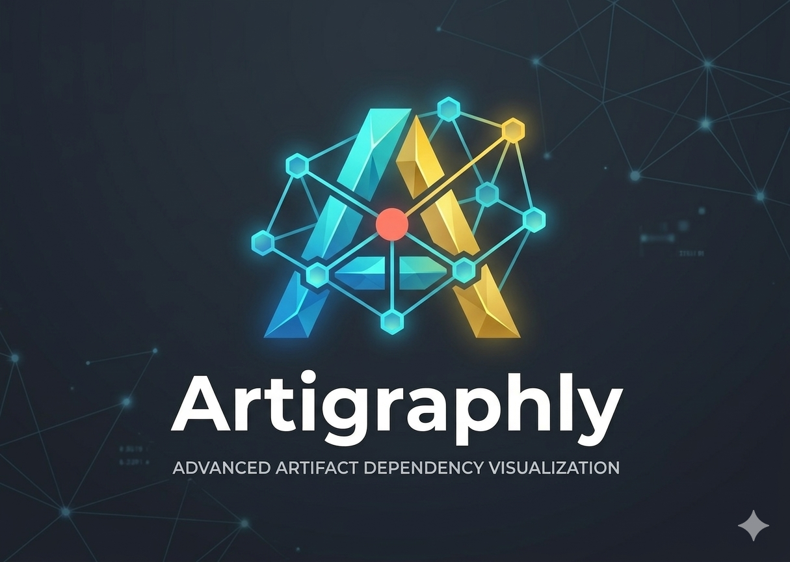
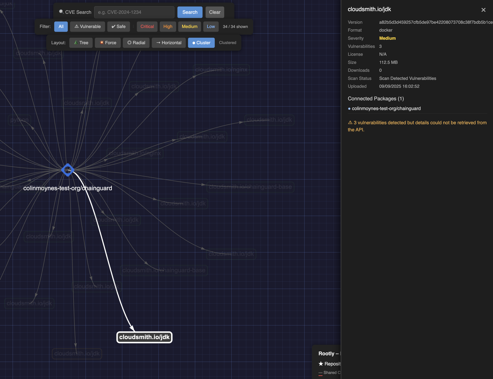

---


**Artigraphly** is a visualization engine for Cloudsmith artifact repositories. It maps packages, dependencies, and vulnerabilities into interactive, color-coded graphs — helping DevOps and Security teams identify blast radii and transitive risks at a glance.




## Architecture

- **Backend** (`backend/`) — FastAPI server that fetches Cloudsmith data and serves it as a JSON API (`/api/graph`, `/api/config`, `/api/health`), with in-memory caching (5 min TTL)
- **Frontend** (`frontend/`) — React + Vite app using [Sigma.js](https://www.sigmajs.org/) (WebGL) for graph rendering via [graphology](https://graphology.github.io/)

## Key Features

- **WebGL rendering** via Sigma.js — smooth 60fps pan/zoom, GPU-accelerated, handles thousands of nodes
- **Edge bundling** — curved edges via `@sigma/edge-curve`, with varying curvature for shared-CVE vs dependency edges
- **Hover glow effects** — node highlighting + size boost on hover via Sigma reducers; un-hovered edges dim out
- **Side panel** — click any node to get a polished detail panel (animated slide-in) with metadata grid, CVE cards with severity badges, advisory links, and shared-CVE cross-references
- **CVE search** — search bar with exact and substring matching, highlights affected nodes
- **Severity filters** — All / Vulnerable / Safe / Critical / High / Medium / Low
- **Layout switcher** — Force-directed, Circular, Radial, Tree (top-down), Horizontal (left-to-right)
- **Refresh button** — force re-fetch from Cloudsmith API
- **Dark security-product theme** — graph-paper grid background, glassmorphism toolbars, custom scrollbars

## 🚀 Quick Start

### 1. Prerequisites

- **Python 3.10+** — [python.org](https://www.python.org/downloads/)
- **Node.js 18+** and **npm** — [nodejs.org](https://nodejs.org/)
- A **Cloudsmith API key** — [Generate one here](https://app.cloudsmith.com/user/settings/api/)

### 2. Clone

```bash
git clone https://github.com/your-user/Artigraphly.git
cd Artigraphly
```

### 3. Configure credentials

Copy the example env file and fill in your API key:

```bash
cp .env.example .env
# Edit .env with your Cloudsmith API key
```

### 4. Run

The start script handles virtual environment creation, dependency installation, and launches both servers:

```bash
./start.sh
```

This will:
- Create a Python virtual environment and install backend dependencies
- Install frontend npm packages (if not already installed)
- Start the backend on **http://localhost:8000**
- Start the frontend on **http://localhost:3000**

Open **http://localhost:3000** in your browser. Press `Ctrl+C` to stop both servers.

<details>
<summary>Manual start (without script)</summary>

```bash
# Terminal 1 — Backend
cd backend
python3 -m venv .venv && source .venv/bin/activate
pip install -r requirements.txt
uvicorn main:app --port 8000

# Terminal 2 — Frontend
cd frontend
npm install
npm run dev
```

</details>

## 🎨 Severity Color Key

| Color | Severity | Description |
|-------|----------|-------------|
| 🔴 `#ff4d4d` | Critical | Critical vulnerabilities |
| 🟠 `#ff8c1a` | High | High severity |
| 🟡 `#ffd11a` | Medium | Medium severity |
| 🔵 `#79b8ff` | Low | Low severity |
| 🟢 `#28a745` | Safe | No vulnerabilities detected |
| ⚫ `#666666` | Unscanned | External / unscanned dependency |
| 🟣 `#9b59b6` | Grouped | Clustered package (multiple versions) |

## 🗺️ Layout Modes

| Layout | Description |
|--------|-------------|
| 💥 Force | Force-directed (ForceAtlas2) — organic clustering by gravity |
| ◎ Circular | Nodes arranged in a circle |
| 🎯 Radial | Repo pinned to center, packages orbit around it |
| 🌳 Tree | Hierarchical top-down — repo at top, packages below, deps at bottom |
| ↔ Horizontal | Left-to-right tree layout |

## 📂 Project Structure

```
Artigraphly/
├── backend/
│   ├── main.py               # FastAPI application
│   ├── cloudsmith.py          # Cloudsmith API client
│   ├── models.py              # Pydantic response models
│   └── requirements.txt       # Python dependencies
├── frontend/
│   ├── src/
│   │   ├── components/        # React components (GraphCanvas, SidePanel, FilterBar, etc.)
│   │   ├── hooks/             # Custom hooks (useGraphData)
│   │   ├── types/             # TypeScript type definitions
│   │   ├── App.tsx            # Root component
│   │   ├── main.tsx           # Entry point
│   │   └── index.css          # Global styles
│   ├── package.json
│   ├── tsconfig.json
│   └── vite.config.ts
├── start.sh                   # Start script (backend + frontend)
├── .env                       # Credentials (not committed)
├── .env.example               # Environment variable template
├── assets/
│   └── readme/                # README images
├── CHANGELOG.md
├── LICENSE
└── README.md
```

## API Endpoints

| Endpoint | Method | Description |
|----------|--------|-------------|
| `/api/health` | GET | Health check |
| `/api/config` | GET | Returns configured owner and repo |
| `/api/namespaces` | GET | List available Cloudsmith workspaces |
| `/api/repos/{owner}` | GET | List repositories for a workspace |
| `/api/graph` | GET | Fetch graph data (cached for 5 min) |
| `/api/graph/refresh` | POST | Force re-fetch from Cloudsmith |

## ⚙️ Configuration

Set the following in your `.env` file:

| Variable | Description |
|----------|-------------|
| `CLOUDSMITH_API_KEY` | Cloudsmith API key |
| `CLOUDSMITH_OWNER` | Cloudsmith organisation / owner |
| `CLOUDSMITH_REPO` | Repository name |


## License

See [LICENSE](LICENSE).