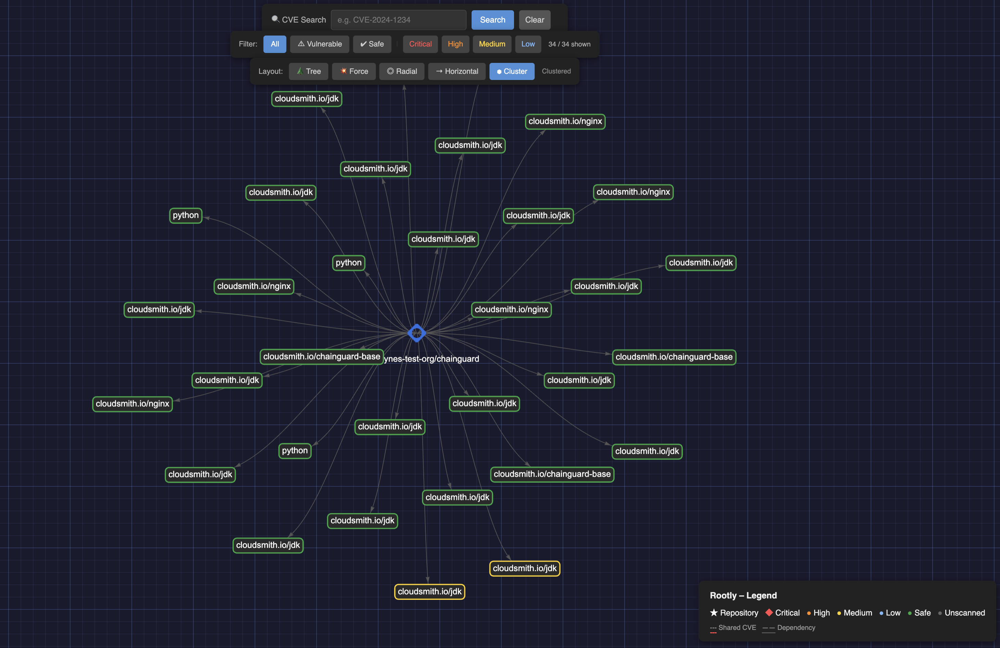

# 🌳 Rootly

**Rootly** is a Python-powered visualization engine for Cloudsmith artifact repositories. It maps packages, dependencies, and vulnerabilities into interactive, color-coded graphs — helping DevOps and Security teams identify blast radii and transitive risks at a glance.




## ✨ Key Features

- **Vulnerability Scanning** – Queries the Cloudsmith vulnerability API to surface CVEs per package, with severity, affected dependency, NVD and GitHub Advisory links.
- **Security Heatmap** – Node borders colored Red → Orange → Yellow → Blue → Green by CVE severity.
- **Interactive Graph** – Fullscreen, graph-paper–styled HTML output with drag, zoom, hover tooltips, and click-to-inspect.
- **5 Layout Modes** – Switch between Tree (top-down), Force-directed, Radial, Horizontal (left-right), and Clustered layouts from the UI.
- **Vulnerability Filters** – Filter the graph to show only Vulnerable, Safe, or specific severity (Critical / High / Medium / Low) packages. Non-matching nodes are fully hidden.
- **CVE Search** – Search by CVE ID with partial matching; highlights affected packages and focuses the view.
- **Package Grouping** – Packages with the same name but different versions are automatically clustered. Click to inspect, double-click to expand.
- **Detail Panel** – Click any node to open a side panel showing version, format, license, size, downloads, scan status, upload date, and full CVE listing with advisory links.
- **Shared-CVE Edges** – Red dashed edges connect packages that share the same CVE.
- **Dependency Mapping** – Traces per-package dependency trees from the Cloudsmith API.
- **Cloudsmith Branding** – Repository hub node uses the Cloudsmith logo.
- **Rich Terminal UI** – Styled CLI output with progress bars, spinners, severity summary table, and configuration panel via the Rich library.
- **Rate-Limit Aware** – Automatic retries with exponential back-off on 429 responses.
- **CLI & Env Config** – Pass owner/repo/key via flags or `.env` file — nothing hardcoded.
- **Zero-DB** – Fetches directly from the Cloudsmith API — no database required.

## 🚀 Quick Start

### 1. Clone & install

```bash
git clone https://github.com/your-user/rootly.git
cd rootly
python -m venv .venv && source .venv/bin/activate
pip install -r requirements.txt
```

### 2. Configure credentials

```bash
cp .env.example .env
# Edit .env with your Cloudsmith API key, org, and repo
```

Or pass them directly:

```bash
python rootly.py --api-key YOUR_KEY --owner YOUR_ORG --repo YOUR_REPO
```

### 3. Generate the graph

```bash
python rootly.py                          # uses .env values
python rootly.py -o myorg -r myrepo       # override org/repo
python rootly.py --no-deps                # skip dependency fetching (faster)
python rootly.py --output my_graph.html   # custom output filename
```

Open the generated `cloudsmith_security_map.html` in your browser.

## 🎨 Severity Color Key

| Color | Severity | Description |
|-------|----------|-------------|
| 🔴 `#ff4d4d` | Critical | Critical vulnerabilities |
| 🟠 `#ff8c1a` | High | High severity |
| 🟡 `#ffd11a` | Medium | Medium severity |
| 🔵 `#79b8ff` | Low | Low severity |
| 🟢 `#28a745` | Safe | No vulnerabilities detected |
| ⚫ `#666666` | Unscanned | External / unscanned dependency |
| 🟣 `#9b59b6` | Grouped | Clustered package (multiple versions) |

## 🗺️ Layout Modes

| Layout | Description |
|--------|-------------|
| 🌲 Tree | Hierarchical top-down — repo at top, packages below, deps at bottom |
| 💥 Force | Force-directed — organic clustering by gravity |
| ◎ Radial | Repo pinned to center, packages orbit around it |
| → Horizontal | Left-to-right tree layout |
| ⬡ Cluster | Repulsion-based — nodes group by connectivity |

## 📂 Project Structure

```
rootly/
├── rootly.py             # Main application
├── requirements.txt      # Python dependencies (requests, networkx, pyvis, python-dotenv, rich)
├── .env.example          # Template for credentials
├── assets/
│   └── cloudsmith.png    # Cloudsmith logo for repo hub node
├── example1.png          # Screenshot – tree layout
├── example2.png          # Screenshot – force layout
├── .gitignore
├── LICENSE
└── README.md
```

## ⚙️ CLI Reference

| Flag | Env Variable | Description |
|------|-------------|-------------|
| `-o, --owner` | `CLOUDSMITH_OWNER` | Cloudsmith organisation / owner |
| `-r, --repo` | `CLOUDSMITH_REPO` | Repository name |
| `-k, --api-key` | `CLOUDSMITH_API_KEY` | API key for authentication |
| `--output` | — | Output HTML filename (default: `cloudsmith_security_map.html`) |
| `--no-deps` | — | Skip per-package dependency fetching |

## License

See [LICENSE](LICENSE).