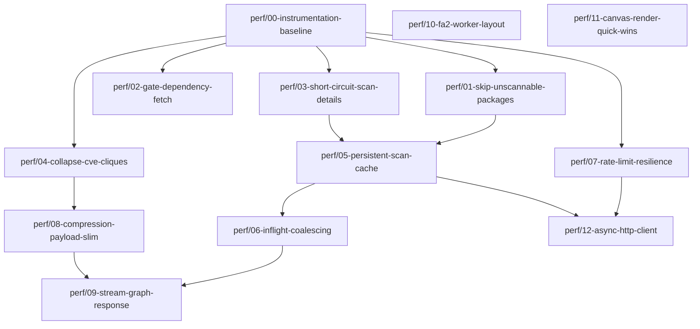

# Forgely — Load Time & Performance Design

| | |
|---|---|
| **Status** | Draft — proposed |
| **Author** | colinmoynes |
| **Date** | 2026-08-03 |
| **Baseline version** | `1.0.0-beta.11` |
| **Target** | Large workspaces load in < 60s cold, < 5s warm |
| **Status vs target** | ✅ **both met** — 44.6s cold, 1.5s warm (§8.8) |

---

## How to read this plan

**Three different orderings are in play, and they deliberately do not line up.**

| Axis | Means | Where | Example |
|---|---|---|---|
| **Tier** | *What kind* of work it is | §4, §5 | Tier 1 = request-volume reduction |
| **Branch number** | Stable identifier, assigned at planning time | §5 | `perf/02` is always `perf/02` |
| **Merge order** | *When* to do it — re-derived from measurement | §6 | `perf/02` is merged **3rd** |

Branch numbers were assigned before anything was measured, so they encode the *original* tier grouping. The §8 baseline then reshuffled the execution order. **Treat the numbers as names, not as sequence** — `perf/11` is Tier 3 but merges 2nd because it is two lines; `perf/12` is Tier 4 but merges 8th because measurement promoted it.

### Hierarchy — Tier → Branch → Commits

```
Tier 0 — Measurement (11 commits)
├── perf/00-instrumentation-baseline ......... 5   ✅ merged (PR #39)
└── perf/00-scan-status-histogram ............ 6   ✅ merged (PR #40)

Tier 1 — Request volume (25 commits)
├── perf/02-gate-dependency-fetch ............ 6   ← biggest win, 53% of network time
├── perf/01-skip-unscannable-packages ........ 5   ← 27%
├── perf/13-parallel-package-pagination ...... 5   🆕 added after baselining
├── perf/03-short-circuit-scan-details ....... 5   ⚠ highest correctness risk
└── perf/04-collapse-cve-cliques ............. 4

Tier 2 — Caching / resilience / transport / UX (20 commits)
├── perf/05-persistent-scan-cache ............ 5
├── perf/06-inflight-coalescing .............. 2
├── perf/07-rate-limit-resilience ............ 4
├── perf/08-compression-payload-slim ......... 4
└── perf/09-stream-graph-response ............ 5

Tier 3 — Frontend rendering (7 commits)
├── perf/14-cap-fa2-iterations ............... 2   🆕 ✅ 18.9s → 2.1s, one line
├── perf/10-fa2-worker-layout ................ 3   ⬇ demoted — little left to hide
└── perf/11-canvas-render-quick-wins ......... 2   ← 2 lines, does not touch FA2

Tier 4 — Concurrency (5 commits)
└── perf/12-async-http-client ................ 5   ⬆ promoted by measurement
```

**16 branches, 68 commits.** Tiers group work by theme; they are *not* a sequence. For the order you actually work through, see **§6**.

### Where to look

| You want | Go to |
|---|---|
| Why the load is slow | §2 |
| What each branch changes, file by file | §5 |
| What to do first | **§6** |
| Real measured numbers | §8 |
| **Frontend cost** (the 29% nobody measured) | **§8.7** |
| Cold vs warm, and why the cache key changed | §8.8 |
| What measurement changed about the plan | §8.5 |
| Tasks for ClickUp | Appendix A |
| `git checkout -b` commands | Appendix B |

In ClickUp each branch is a task and each commit a subtask; the tier lives on `Tags`, so tier and priority views are both recoverable.

---

## 1. Problem

On large Cloudsmith workspaces — repositories with several thousand packages — initial graph load takes **5–10 minutes**. During this window the UI shows only a spinner, and a single rate-limit exhaustion can fail the entire request, discarding all completed work.

Three independent bottlenecks contribute, in descending order of impact:

1. **Request volume** — the graph build issues roughly three Cloudsmith API calls per package.
2. **Quadratic edge generation** — shared-CVE edges grow as the square of packages-per-CVE.
3. **Blocking main-thread layout** — ForceAtlas2 runs synchronously in the browser.

This document quantifies each, proposes fixes, and sequences them into independently mergeable branches.

---

## 2. Root cause analysis

### 2.1 Request volume — `~3P` calls for `P` packages

[`_build_graph`](../backend/main.py#L151-L346) issues, for a repository of `P` packages:

| Work | Call count | Source |
|---|---|---|
| Package list pagination | `⌈P/100⌉` | [`fetch_all_packages`](../backend/cloudsmith.py#L224-L238) |
| Vulnerability scan list, one per package | `P` | [main.py:186-198](../backend/main.py#L186-L198) |
| Scan **detail** fetch — fires whenever the list response embeds no vulns, which is the normal case for clean packages | `~P` | [cloudsmith.py:325-334](../backend/cloudsmith.py#L325-L334) |
| Fallback walk over *older* scans when still empty | up to `P × (scans−1)` | [cloudsmith.py:336-349](../backend/cloudsmith.py#L336-L349) |
| Dependencies, one per slug, **ungated by format** | `P` | [main.py:321-333](../backend/main.py#L321-L333) |

**≈ 3P requests minimum.** A 5,000-package repository is ~15,000 HTTP round-trips at 20 workers. At 200ms per call that is a ~2.5 minute network floor before any throttling.

Two aggravating factors:

- **No filtering.** [`_fetch_repo_vuln_summary`](../backend/main.py#L653-L660) already skips packages whose `security_scan_status` contains `"not supported"` or `"awaiting"`. `_build_graph` does not — it reads `scan_status` at [main.py:208](../backend/main.py#L208), *after* paying for the network call.
- **Throttling collapses throughput.** [`_api_get`](../backend/cloudsmith.py#L51-L63) handles 429 with a blocking `time.sleep(retry_after)` *inside a worker thread*. Under sustained rate limiting, all 20 workers park simultaneously — throughput goes to zero rather than degrading gracefully.

### 2.2 Quadratic edge generation

[main.py:303-314](../backend/main.py#L303-L314) emits a complete clique for each CVE: a vulnerability affecting `k` packages produces `k(k−1)/2` edges.

| Packages sharing one CVE | Edges emitted |
|---|---|
| 50 | 1,225 |
| 300 | 44,850 |
| 800 | 319,600 |

A single widely-shared transitive CVE can therefore dominate total payload size, JSON serialisation time, and render cost. On vulnerability-dense repositories this likely exceeds the API-call cost. [The shared-upstream logic at main.py:1070-1083](../backend/main.py#L1070-L1083) has the identical structure over repositories sharing an upstream URL.

### 2.3 Caching is ineffective at this scale

- `CACHE_TTL = 300` ([main.py:73](../backend/main.py#L73)) — **shorter than the load it caches.** A six-minute build is already stale on arrival.
- `_cache` is in-process and unbounded — lost on every restart, grows without eviction.
- No in-flight deduplication: two tabs, or a second click on **Go**, launches two complete concurrent builds at 20 workers each.

### 2.4 Failure handling

After three retries `_api_get` raises `RuntimeError`, which propagates uncaught through `fut.result()` at [main.py:197](../backend/main.py#L197) → HTTP 500. The user loses the entire multi-minute build. `workspace_overview` guards per-repo ([main.py:751-754](../backend/main.py#L751-L754)); `_build_graph` has no equivalent.

### 2.5 Frontend rendering

- [GraphCanvas.tsx:195-208](../frontend/src/components/GraphCanvas.tsx#L195-L208) runs up to 800 FA2 iterations via `forceAtlas2.assign` — **synchronous, main thread**. The tab is frozen for the duration: **measured at 18.9s on a 7,544-node graph** (§8.7). Worse, the iteration count *scaled up* with graph size while FA2 costs `O(iterations x N log N)`, so large graphs ran the most iterations at the highest per-iteration cost — and needed them least.
- [WorkspaceOverviewCanvas.tsx:52-55](../frontend/src/components/WorkspaceOverviewCanvas.tsx#L52-L55) omits `barnesHutOptimize`, making it `O(N²)` per iteration where the other canvases are `O(N log N)`.
- No `hideEdgesOnMove` on the Sigma constructor ([GraphCanvas.tsx:542](../frontend/src/components/GraphCanvas.tsx#L542)) — pan/zoom is edge-bound on clique-heavy graphs.

### 2.6 Transport

Only CORS middleware is registered ([main.py:64-69](../backend/main.py#L64-L69)). No compression, on a payload that is highly repetitive JSON carrying full CVE descriptions per node.

---

## 3. Design principles

1. **Do not fetch what cannot be used.** Every call must have a plausible chance of returning data.
2. **Immutable data is cached forever.** A completed scan result never changes; only the package list needs a short TTL.
3. **Partial results beat total failure.** A graph missing 2% of scan data is useful; a 500 after eight minutes is not.
4. **Perceived latency is latency.** Streaming first paint changes the experience more than any single throughput gain.
5. **One concern per branch.** Each branch below is independently mergeable and independently revertable.

---

## 4. Tiers

| Tier | Theme | Expected effect |
|---|---|---|
| **0** | Measurement | No user-visible change; establishes the baseline all other claims are checked against |
| **1** | Request-volume reduction | Cold load 3–5× faster |
| **2** | Caching, resilience, transport | Warm load near-instant; eliminates total-failure mode |
| **3** | Frontend rendering | UI stops freezing; pan/zoom smooth at scale |
| **4** | Async rewrite | Deferred — only if measurement shows residual network-bound cost |

> **Sequencing note.** Tier 0 lands first and stays. The estimates in §2 are derived from call structure, not measurement; Tier 0 exists to confirm whether the system is network-bound or rate-limit-bound, because those want different fixes. Do not start Tier 4 before re-measuring after Tier 1.

---

## 5. Branch plan

Branch naming: `perf/<nn>-<slug>`. All branch off `main` unless a dependency is stated.



---

### Tier 0 — Measurement

#### `perf/00-instrumentation-baseline` — ✅ implemented

**Base:** `main` · **Depends on:** — · **Size:** S · **Risk:** None

Everything downstream is validated against numbers this branch produces. Land it first and keep it.

**Files:** new [`backend/perfstats.py`](../backend/perfstats.py), [`backend/cloudsmith.py`](../backend/cloudsmith.py), [`backend/main.py`](../backend/main.py)

##### How to use it

Counters are always on and cost nothing measurable — one dict update per HTTP call. A stats block is written to the `forgely.perf` logger at the end of every graph, org-graph, and workspace-overview build:

```
PERF graph acme/big-repo — 428.7s wall, 12342 API calls
  result:    packages=4200, nodes=5310, edges=214880, cves=918
  throttle:  2 x 429, 90.0s slept, 2 retries, 0 failures
  ratelimit: limit=5000 remaining=12 reset=1754320000
  endpoint                   calls      mean    total  statuses
  vulns.scans                 4200      180ms   756.0s  200:4200
  packages.dependencies       4200       90ms   378.0s  404:4200
  vulns.details               3900      210ms   819.0s  200:3900
  packages.list                 42      300ms    12.6s  200:42
  deps:      3100 calls returned nothing; formats with data: npm
    docker                 3100 calls       0 non-empty
    npm                    1100 calls    1100 non-empty
```

Payload size requires a second full serialisation, so it is opt-in — set `FORGELY_PERF_PAYLOAD=1` for the baseline runs that populate §8, and leave it off otherwise.

The same block is available as JSON via `GET /api/graph?owner=…&repo=…&debug=1`, which returns `{graph, cached, perf}`. Returning a `Response` directly bypasses `response_model`, so normal traffic keeps its schema unchanged.

##### How to read it, and what each line decides

| Line | Feeds |
|---|---|
| `vulns.scans` vs `vulns.details` — a near-1:1 ratio is the N+1 | `perf/03` — the ratio is the size of the prize |
| `packages.dependencies` with a high `404:` count | `perf/02` — every 404 is a wasted round-trip |
| `deps:` per-format breakdown — formats with `0 non-empty` | `perf/02` — populates `DEPENDENCY_FORMATS` empirically |
| `edges=` vs `nodes=` | `perf/04` — quantifies clique blowup |
| `throttle:` seconds slept, and `ratelimit: remaining` | **Open question #2.** High sleep / near-zero remaining ⇒ limit-bound, and `perf/12` is pointless. Low sleep with high mean latency ⇒ concurrency-bound, and `perf/12` pays. |

##### Implementation notes

- Counters hang off the `requests.Session` (`session.forgely_stats`). Each build already creates its own session in [`create_session`](../backend/cloudsmith.py#L34-L52), so attribution is per-build with no global state and no cross-request bleed.
- `RequestStats` takes a lock on every mutation — it is written from up to 20 worker threads. Verified: 20 threads × 500 increments retains all 10,000.
- Bucketing lives in `bucket_for()` and splits **`vulns.scans` from `vulns.details`** deliberately; collapsing them would hide the exact quantity `perf/03` exists to remove.
- `fetch_dependencies` gained an optional `fmt` argument used *only* for instrumentation. It has a default, so no call site is forced to change.
- The `forgely.perf` logger is set to INFO explicitly because the root logger sits at WARNING ([main.py:54-58](../backend/main.py#L54-L58)). Records propagate to the root handler, so the block appears without making everything else verbose.
- Perf snapshots are held in `_last_perf`, deliberately **outside** `_cache`, so cached graph payloads never carry stale timing data.

**Changes**
- Attach a thread-safe counter to the session object in [`create_session`](../backend/cloudsmith.py#L34-L48). Each build already constructs its own session, so per-build attribution is free.
- Increment in [`_api_get`](../backend/cloudsmith.py#L51-L63), bucketed by endpoint family (`packages`, `vulnerabilities`, `dependencies`, `privileges`, …). Record 429 count and cumulative sleep time separately.
- Log on completion of `_build_graph`, `_build_org_graph`, and `workspace_overview`: wall time, request count per bucket, 429 count, seconds lost to `Retry-After`, node count, edge count, serialised payload bytes.
- Capture `X-RateLimit-Limit` / `X-RateLimit-Remaining` / `X-RateLimit-Reset` response headers into the log line — these determine whether Tier 4 is worth doing at all.
- Add a `?debug=1` query param on `/api/graph` returning the stats block alongside the graph.

**Acceptance criteria**
- ✅ One log record per build with the full stats block.
- ✅ Zero behaviour change — instrumentation only observes; control flow in `_api_get` is identical.
- ⬜ Baseline recorded for at least one small (<200 pkg), one medium (~1k), and one large (5k+) repository. **Commit these numbers to §8.** ← *outstanding: needs a real API key against real workspaces.*

**Also records** the data needed to build the format list in `perf/02` — which package formats ever return a non-empty dependency array.

---

### Tier 1 — Request-volume reduction

#### `perf/01-skip-unscannable-packages`

**Base:** `main` · **Depends on:** `perf/00` (for verification) · **Size:** S · **Risk:** Low–Medium

**Files:** [`backend/main.py`](../backend/main.py)

**Changes**
- In the `pkg_metas` construction loop ([main.py:171-184](../backend/main.py#L171-L184)), add a `scannable` flag derived from `pkg["security_scan_status"]`, mirroring [main.py:653-660](../backend/main.py#L653-L660).
- Submit **only** scannable metas to the ThreadPoolExecutor ([main.py:194-198](../backend/main.py#L194-L198)). Seed `vuln_results[node_id] = (None, 0, [])` for the rest, so the node-building loop at [main.py:200](../backend/main.py#L200) is untouched.

> ### 🛑 Unscannable packages must still appear in the graph
>
> **`pkg_metas` must not be filtered.** `_build_graph` iterates it twice — once to submit vulnerability fetches ([main.py:194-198](../backend/main.py#L194-L198)) and once to build nodes ([main.py:200](../backend/main.py#L200)). This branch narrows **only the first**. Every package keeps its node and its `repo_package` edge.
>
> **Do not copy the filter shape from [`_fetch_repo_vuln_summary`](../backend/main.py#L653-L660).** That function `continue`s out of its loop, which is correct there because it only accumulates counters — but in `_build_graph` the same `continue` would delete the node. This is the likely implementation error; reviewers should check for it specifically.
>
> Rendering path, unchanged by this branch: `max_severity: null` → `sev = "Unknown"` ([GraphCanvas.tsx:448](../frontend/src/components/GraphCanvas.tsx#L448)) → grey node, visible by default. Users can opt to hide them via the `hideUnsupported` toggle, which defaults to `false` ([App.tsx:47](../frontend/src/App.tsx#L47)). Stats accounting is also unchanged — `None` is not a key in `stats`, so these packages continue to fall through to `stats["Safe"]`.

**Measured impact (§8.4): removes 5,603 of 7,490 scan calls — 74.8%, ~1,210s of network time, 27% of the build.** Second-largest win in the plan.

**⚠ Behaviour decision required.** The two skip conditions are not equivalent:

| Status | Skipping is | Rationale |
|---|---|---|
| `"not supported"` | **Behaviour-neutral** | `(None, 0, [])` flows into the `"not supported" in scan_status` branch at [main.py:225-228](../backend/main.py#L225-L228), preserving `max_sev = None` → grey. Identical output. |
| `"awaiting"` | **Behaviour-changing** | Falls through to the `else` at [main.py:229-234](../backend/main.py#L229-L234), which forces `"Scanned (Clean)"` / green. A pending package would render as clean. |

Recommendation: skip `"not supported"` in this branch. Handle `"awaiting"` separately by introducing a distinct *pending* node state (amber/hatched) rather than silently colouring it green — a security tool should not present "not yet scanned" as "clean". That is a UX change and belongs in its own branch.

> **Measurement update (§8.4):** `the language repository` and `the container repository` contain **zero** packages in `awaiting` state, and the 5,603 unsupported packages produced **zero** detail fetches — confirming their scan lists come back empty, so substituting `(None, 0, [])` is byte-identical. The behaviour-change risk is therefore not merely bounded but *unobserved*, and skipping `"not supported"` alone captures the entire 27% saving. Do not skip `"awaiting"` to chase a gain the data says is zero.

**Acceptance criteria — all met, see §8.6**
- ✅ `total_nodes` / `total_edges` unchanged — **7,544 / 7,650, delta 0**. All 5,603 unscannable packages still present.
- ✅ Every unsupported-format package still renders grey — **0 with `max_severity != None`**.
- ✅ `vulns.scans` drops 7,490 → **1,887**; wall 229.5s → **172.8s**.
- ✅ `scanstatus:` `must scan` matches the new `vulns.scans` count exactly (1,887 = 1,887).
- ✅ No severity or CVE drift on any package — **0 changed**.

**Measured impact: 229.5s → 172.8s.** The original guess here — "large on docker/raw/deb, negligible on pure npm/PyPI" — was wrong in its reasoning: the saving is driven by `alpine` (5,580 of 5,603 unscannable packages), a format the estimate never mentioned. Expect the benefit to track the share of packages Cloudsmith cannot scan, whatever formats those happen to be, rather than any particular format list.

---

#### `perf/02-gate-dependency-fetch`

**Base:** `main` · **Depends on:** `perf/00` (supplies the format list) · **Size:** S · **Risk:** Low

**Files:** [`backend/cloudsmith.py`](../backend/cloudsmith.py), [`backend/main.py`](../backend/main.py)

**Changes**
- Add a `DEPENDENCY_FORMATS: frozenset[str]` constant to `cloudsmith.py`, alongside the existing [`UPSTREAM_FORMATS`](../backend/cloudsmith.py#L193-L197).
- Gate the submission loop at [main.py:322](../backend/main.py#L322) on the package's `format`.
- Deduplicate by `node_id` before submitting — `slug_to_id` holds one entry per `slug_perm`, so name@version collisions currently produce redundant fetches writing to the same `src_id`.

> **Populate `DEPENDENCY_FORMATS` from the Tier 0 logs, not from assumption.** Start from the formats observed to return non-empty dependency arrays; treat the constant as a denylist-by-omission and note that adding a format is a one-line change.
>
> **⚠ Measured 2026-08-14 (§8.3): 10,376 of 10,420 dependency calls returned nothing — 99.6% waste, 53% of all network time.** Only `conda`, `maven`, `rpm` and `ruby` ever returned data. But `npm` came back empty across 1,822 calls and `python` across 17, and both formats *can* carry dependency metadata — so an allowlist built from this one workspace risks silently dropping edges elsewhere. Gate on a **denylist** of formats observed empty at high volume (`alpine`, `npm`, `docker`, `raw`, `generic`), keep a `WARNING` when a gated format is skipped, and make the set overridable by env var so a wrong call is recoverable without a redeploy.

**Also dedupe by `node_id`.** The endpoint is called once per `slug_perm` (10,420) though only 7,490 node IDs are unique — **2,930 calls are exact duplicates**, removable independently of any format gating.

**Acceptance criteria — all met, see §8.6**
- ✅ `packages.dependencies` bucket drops from 10,420 to under 200 — **measured 80**.
- ✅ Wall time drops from 342.5s to ~222s — **measured 229.5s**, within 3% of projection.
- ✅ No dependency edge present on `main` is missing — **edge set diff: 0 lost, 0 gained**.

**Expected impact — measured, not estimated: 53% of all network time, 99.6% of it wasted.** The largest single win in the plan.

---

#### `perf/03-short-circuit-scan-details`

**Base:** `main` · **Depends on:** `perf/00` · **Size:** M · **Risk:** **Medium — highest correctness risk in Tier 1**

**Files:** [`backend/cloudsmith.py`](../backend/cloudsmith.py)

**Changes to [`get_package_vulnerabilities`](../backend/cloudsmith.py#L308-L387)**
- After selecting `latest` and reading `api_count`, return early with `("None", 0, [])` when `api_count == 0` **and** `max_severity` is absent or in `("None", "Unknown")`. This skips the detail fetch for every clean package — the dominant case.
- Cap the historical-scan fallback loop ([cloudsmith.py:336-349](../backend/cloudsmith.py#L336-L349)) at **one** additional scan. It is currently unbounded: a package with ten historical scans can issue nine extra detail calls.

**Risk.** If the Cloudsmith list endpoint does not reliably populate `num_vulnerabilities`, early return would mask real vulnerabilities — a false-negative in a security tool. This must be validated, not assumed.

**Acceptance criteria — all met, see §8.6** *(stricter than other branches — this one can hide findings)*
- On a repository with known vulnerable packages, the full graph JSON is **byte-identical** to `main` for all `max_severity`, `vuln_count`, and `cves` fields.
- Explicitly verify at least one package where the list response reports `num_vulnerabilities > 0` but embeds no vuln array — confirm the detail fetch still fires.
- Log a `WARNING` when a scan reports `num_vulnerabilities == 0` but a detail fetch would have returned vulns; run with the short-circuit disabled via env flag for one cycle to confirm the count is zero.

**Expected impact:** Roughly halves total request count.

---

#### `perf/04-collapse-cve-cliques`

**Base:** `main` · **Depends on:** `perf/00` · **Size:** L · **Risk:** Medium — visual change

**Files:** [`backend/main.py`](../backend/main.py), [`frontend/src/types/index.ts`](../frontend/src/types/index.ts), [`frontend/src/components/GraphCanvas.tsx`](../frontend/src/components/GraphCanvas.tsx), [`frontend/src/components/FilterBar.tsx`](../frontend/src/components/FilterBar.tsx), [`frontend/src/components/Legend.tsx`](../frontend/src/components/Legend.tsx)

Three viable approaches. **Decide before starting** — they differ materially in blast radius.

| | **A — CVE hub nodes** | **B — Client-derived cliques** | **C — Cap clique size** |
|---|---|---|---|
| Backend emits | `cve:<id>` node + `k` edges | nothing | clique if `k ≤ N`, else hub |
| Payload | `O(k)` | `O(1)` | bounded |
| Frontend change | new node type, legend, reducers | derive adjacency from `node.data.cves` | minimal |
| Visual change | **Significant** — new node class | none | only on large CVEs |
| Effort | High | Medium | **Low** |

**Recommendation: C for this branch, A as a follow-up if the visualisation proves better.** C removes the pathological case with minimal risk and no design debate; A is arguably the better long-term model (a CVE genuinely *is* an entity in a security graph) but is a product decision, not a performance one.

Note that the frontend already derives a `sharedCveNodes` set from edges at [GraphCanvas.tsx:327-336](../frontend/src/components/GraphCanvas.tsx#L327-L336). Under option B this set would be built from each node's `data.cves` array instead — the data is already present client-side, so the backend need not ship these edges at all. The blocker for B is that shared-CVE edges are also *rendered* ([GraphCanvas.tsx:826](../frontend/src/components/GraphCanvas.tsx#L826)), so removing them entirely is a visual regression unless the client materialises them locally.

**Apply the same fix to [`shared_upstream`](../backend/main.py#L1070-L1083)** in `_build_org_graph` — identical quadratic structure over repositories sharing an upstream URL.

**Acceptance criteria**
- Edge count on the worst-case repository drops by the expected factor; record before/after in §8.
- All eight `shared_cve` call sites in `GraphCanvas.tsx` still behave correctly — the FilterBar toggle, search highlighting, and hide-edges toggle in particular.

**Expected impact:** Potentially the single largest payload and render win on vulnerability-dense repositories.

---

#### `perf/13-parallel-package-pagination`

**Base:** `main` · **Depends on:** `perf/00` · **Size:** M · **Risk:** Low
**Added after baselining — not in the original plan.**

**Files:** [`backend/cloudsmith.py`](../backend/cloudsmith.py)

[`fetch_all_packages`](../backend/cloudsmith.py#L246-L260) walks pages in a `while` loop, one at a time. On the large repo that is **105 sequential calls at a 1,169ms mean — 122.8s, or 36% of total wall time**, during which the 20-worker pool sits completely idle. It is the largest single block of un-parallelised time in the build.

Note the mean latency: package-list pages are ~5× slower per call than any other endpoint, because each returns 100 full package records. This is why a modest page count still dominates.

**Changes**
- Read the total count from the list response headers on the first page — Cloudsmith returns pagination metadata (`X-Pagination-Count` / `X-Pagination-Pagetotal`); **confirm the exact header name against a live response before relying on it**.
- With a known page total, fetch pages 2..N through a `ThreadPoolExecutor`.
- If no count header is available, fall back to speculative batching: request pages in blocks of ~10 concurrently, stopping at the first short/empty page. Slightly over-fetches at the boundary; still far better than fully sequential.
- Apply to [`fetch_repos`](../backend/cloudsmith.py#L86-L99), [`fetch_org_members`](../backend/cloudsmith.py#L102-L115) and [`fetch_org_services`](../backend/cloudsmith.py#L118-L131), which share the identical loop shape.

**Acceptance criteria — all met, see §8.6**
- ✅ `packages.list` wall contribution drops from ~123s to under 20s — **measured ~17s**; build 172.8s → **64.6s**.
- ✅ Package set identical to `main` — **10,420 packages, no duplicate slugs**, verified across six boundary cases including exact-multiple-of-page-size.
- ✅ All 12 node metadata fields identical across 7,490 packages; edge set unchanged.
- **Page order MUST be preserved.** ⚠ *This corrects the original spec, which said ordering changes were acceptable "because the graph builder de-duplicates by `node_id`". That reasoning is wrong.* `_build_graph` keeps the **first** package it encounters for a given `name@version` and discards the rest ([main.py:212-217](../backend/main.py#L212-L217)), so concatenation order decides which package's `format`, `size`, `licence` and `uploaded_at` end up on the node. With 2,930 duplicate `node_id`s on `the language repository` (§8.3), out-of-order concatenation would silently alter up to 2,930 nodes' metadata while leaving every count identical — a diff on `total_nodes` would not catch it. Collect pages into a dict keyed by page number and concatenate in sorted order.

**Expected impact:** ~110s off the large-repo build on its own; proportionally larger once `perf/02` shrinks the parallel phase.

---

### Tier 2 — Caching, resilience, transport

#### `perf/05-persistent-scan-cache`

**Base:** `main` · **Depends on:** `perf/01`, `perf/03` · **Size:** L · **Risk:** Medium

**Files:** [`backend/main.py`](../backend/main.py), [`backend/cloudsmith.py`](../backend/cloudsmith.py), new `backend/cache.py`, [`backend/requirements.txt`](../backend/requirements.txt)

**Changes**
- New `backend/cache.py` wrapping SQLite (stdlib — no new dependency required; prefer this over `diskcache` unless concurrency demands it).
- Key scan results on `(owner, repo, slug_perm, scan_identifier)`. **These are immutable** — a completed scan never changes — so TTL can be effectively infinite. Only new packages and new scans cost network.
- Keep the package *list* on a short TTL (5–10 min); it is the only volatile input.
- Raise `CACHE_TTL` ([main.py:73](../backend/main.py#L73)) for assembled graphs, or drop the in-memory graph cache entirely once the scan-level cache makes rebuilds cheap.
- Add cache hit/miss counters to the Tier 0 stats block.

**Acceptance criteria**
- Second load of an unchanged 5k-package repository completes in < 5s.
- Cache survives backend restart.
- Adding one package to a cached repository fetches exactly one scan.

**Note:** the existing `_cache` dict is unbounded and holds full `GraphResponse` objects for every repo plus workspace overviews. Add eviction here or drop it.

---

#### `perf/06-inflight-coalescing`

**Base:** `main` · **Depends on:** `perf/05` · **Size:** S · **Risk:** Low

**Files:** [`backend/main.py`](../backend/main.py)

Maintain `dict[cache_key, Future]` guarded by a lock. Concurrent callers for the same key await the same build rather than launching a second one. Applies to `/api/graph` ([main.py:349-367](../backend/main.py#L349-L367)), `/api/workspace-overview` ([main.py:721](../backend/main.py#L721)), and `/api/org-graph` ([main.py:1102](../backend/main.py#L1102)).

**Acceptance criteria:** two simultaneous requests for the same repo produce one set of upstream API calls, verified via the Tier 0 counter.

---

#### `perf/07-rate-limit-resilience`

**Base:** `main` · **Depends on:** `perf/00` · **Size:** M · **Risk:** Low

**Files:** [`backend/cloudsmith.py`](../backend/cloudsmith.py), [`backend/main.py`](../backend/main.py)

**Changes**
- **Isolate per-package failure.** Wrap `fut.result()` at [main.py:197](../backend/main.py#L197) and [main.py:324](../backend/main.py#L324) in try/except, mirroring the guard already present at [main.py:751-754](../backend/main.py#L751-L754). Degrade to partial data; never lose a completed build to one failed package.
- **Surface partial results.** Add a `partial: bool` and `failed_count: int` to `GraphResponse` ([backend/models.py](../backend/models.py)) so the UI can warn rather than silently under-report vulnerabilities. **This matters** — a security graph that quietly omits packages is worse than one that says so.
- **Pace proactively.** Replace reactive 429 handling with a shared token bucket seeded from `X-RateLimit-Remaining` / `X-RateLimit-Reset`. Currently all 20 workers park in `time.sleep` simultaneously ([cloudsmith.py:55-60](../backend/cloudsmith.py#L55-L60)); pacing before the limit avoids the stall entirely.
- Raise `MAX_RETRIES` from 3 and add jitter, now that failure is non-fatal.

**Acceptance criteria**
- A forced 429 storm yields a partial graph with an accurate `failed_count`, not a 500.
- Seconds-lost-to-`Retry-After` in the Tier 0 stats drops materially on a large workspace.

---

#### `perf/08-compression-payload-slim`

**Base:** `main` · **Depends on:** `perf/04` · **Size:** M · **Risk:** Low

**Files:** [`backend/main.py`](../backend/main.py), [`backend/models.py`](../backend/models.py), [`frontend/src/components/SidePanel.tsx`](../frontend/src/components/SidePanel.tsx)

- Register `GZipMiddleware` alongside CORS ([main.py:64-69](../backend/main.py#L64-L69)) with `minimum_size=1000`. One line; expect 5–10× reduction on this payload shape.
- Drop `description` from `CVERecord` in the graph payload and lazy-load on node click via a new `/api/cve/{owner}/{repo}/{slug}` endpoint. Descriptions are long, repeated across packages sharing a CVE, and invisible until a node is selected.

**Acceptance criteria:** transfer size for the largest repo recorded before/after in §8; SidePanel still shows full descriptions on click.

---

#### `perf/09-stream-graph-response`

**Base:** `main` · **Depends on:** `perf/06`, `perf/08` · **Size:** L · **Risk:** Medium

**Files:** [`backend/main.py`](../backend/main.py), [`frontend/src/hooks/useGraphData.ts`](../frontend/src/hooks/useGraphData.ts), [`frontend/src/components/LoadingIndicator.tsx`](../frontend/src/components/LoadingIndicator.tsx), [`frontend/src/components/GraphCanvas.tsx`](../frontend/src/components/GraphCanvas.tsx)

Convert `/api/graph` to NDJSON over `StreamingResponse`: emit the repo node and all package nodes immediately (available from the package-list call alone), then vulnerability data as futures resolve, then dependency edges, then a final stats frame.

[`useGraphData`](../frontend/src/hooks/useGraphData.ts#L19-L27) currently awaits `resp.json()` in one shot; rewrite to read the stream and update incrementally. `LoadingIndicator` becomes a real progress bar.

**This does not make the load faster — it makes it *feel* dramatically faster.** First paint in ~2s instead of a multi-minute spinner. Defer the layout run until the node set is complete, or use the Tier 3 worker supervisor so nodes visibly settle as they arrive.

**Optional: risk-first ordering via `vulnerability_policy_violated`.** Per open question #1, a single query returns every package breaching the org's vulnerability policy. Issue that query up front and scan those packages first, so the highest-risk nodes resolve within seconds rather than at a random point in the stream. Strictly a *scheduling* optimisation — the remaining packages must still be scanned exhaustively, because the predicate reflects only the configured policy threshold and returns nothing where no policy exists. Never use it to decide what to skip.

**Acceptance criteria:** first nodes painted within 3s on a 5k-package repository; progress indicator monotonic; abort on navigation cancels the backend build.

---

### Tier 3 — Frontend rendering

Independent of all backend work; can be developed in parallel by a second person.

#### `perf/10-fa2-worker-layout`

**Base:** `main` · **Depends on:** — · **Size:** M · **Risk:** Low

**Files:** [`GraphCanvas.tsx`](../frontend/src/components/GraphCanvas.tsx), [`OrgGraphCanvas.tsx`](../frontend/src/components/OrgGraphCanvas.tsx), [`WorkspaceOverviewCanvas.tsx`](../frontend/src/components/WorkspaceOverviewCanvas.tsx)

Replace synchronous `forceAtlas2.assign` with `FA2LayoutSupervisor` from `graphology-layout-forceatlas2/worker`. **Already present in `node_modules`** — verified at `node_modules/graphology-layout-forceatlas2/worker.js`; no dependency change needed.

Run for a bounded duration or until convergence, then `kill()`. Ensure the supervisor is stopped on unmount and on layout switch. Preserve the existing radial pre-placement ([GraphCanvas.tsx:174-193](../frontend/src/components/GraphCanvas.tsx#L174-L193)) and the post-layout re-anchoring of the repo node to origin ([GraphCanvas.tsx:210-215](../frontend/src/components/GraphCanvas.tsx#L210-L215)).

**Acceptance criteria:** main thread never blocks > 50ms during layout; no supervisor leaks across layout switches (check with repeated toggling).

---

#### `perf/11-canvas-render-quick-wins`

**Base:** `main` · **Depends on:** — · **Size:** XS · **Risk:** Very low

**Files:** [`WorkspaceOverviewCanvas.tsx`](../frontend/src/components/WorkspaceOverviewCanvas.tsx), [`GraphCanvas.tsx`](../frontend/src/components/GraphCanvas.tsx)

- Add `barnesHutOptimize: true` at [WorkspaceOverviewCanvas.tsx:52-55](../frontend/src/components/WorkspaceOverviewCanvas.tsx#L52-L55). It is the only canvas missing it — currently `O(N²)` per iteration across up to 600 iterations. `adjustSizes: true` is compatible; the installed implementation honours it inside the Barnes-Hut branch (verified in `iterate.js`).
- Add `hideEdgesOnMove: true` to the Sigma constructor at [GraphCanvas.tsx:542](../frontend/src/components/GraphCanvas.tsx#L542).

Two lines, no behavioural risk. Could reasonably be the first thing merged.

**Note (§8.7): this does not address the 18.9s FA2 freeze.** `GraphCanvas` already sets `barnesHutOptimize: total > 150`. These two lines help the workspace-overview canvas and pan/zoom smoothness only.

---

#### `perf/14-cap-fa2-iterations` — ✅ implemented

**Base:** `main` · **Depends on:** — · **Size:** XS · **Risk:** Low — visual
**Added after measuring the frontend — not in the original plan.**

**Files:** [`frontend/src/components/GraphCanvas.tsx`](../frontend/src/components/GraphCanvas.tsx)

**The largest single win in the plan after `perf/02`, and it is one line.** FA2 blocked the main thread for **18.9s** on a 7,544-node graph (§8.7) — 29% of total user wait, entirely unmeasured through six branches of backend work.

The iteration count scaled *up* with graph size (`Math.min(800, 350 + total * 2)`) while FA2 costs `O(iterations x N log N)`. Large graphs therefore ran the most iterations at the highest per-iteration cost, and needed them least. Replaced with an inverse budget so cost stays bounded:

```js
Math.min(800, Math.max(50, Math.round(750000 / total)))
```

**Acceptance criteria — all met, see §8.7**
- ✅ Large-graph layout time drops materially — **20,255ms → 2,146ms, −18.1s**.
- ✅ No regression on small, genuinely clustered graphs — `the container repository` 177ms → 184ms, iterations 780 → 800.
- ✅ Layout quality preserved — every node within 0.07% of its 800-iteration position on `the language repository`; renders at 800/200/100/50 are indistinguishable.
- ✅ `GraphCanvas.tsx` typechecks clean (the 13 `tsc` errors are pre-existing in `OrgSidePanel.tsx`).

> **Verify the constant against a clustered graph before changing it.** A flat cap was the obvious fix and would have been wrong: `the container repository` is still improving at 780 iterations and has not converged even at 2,000. It is small enough that the whole run costs 175ms, so it should keep the full budget — which the inverse formula gives it.

---

### Tier 4 — Deferred

#### `perf/12-async-http-client`

**Base:** `main` · **Depends on:** `perf/05`, `perf/07` · **Size:** XL · **Risk:** High

**Do not start before re-measuring after Tier 1 and 2.**

Convert `cloudsmith.py` from `requests` to `httpx.AsyncClient` with an `asyncio.Semaphore`, and convert the FastAPI endpoints from `def` to `async def`. Twenty threads is near the practical ceiling for blocking I/O in a sync endpoint (which occupies one of FastAPI's default 40 threadpool slots for the entire build); async allows 100+ concurrent requests at a fraction of the memory.

**This is only worth doing if measurement shows residual network-bound cost.** If Tier 0 shows you are rate-limit-bound rather than concurrency-bound, higher concurrency achieves nothing — it just hits the ceiling faster. Decide from the data.

---

## 6. Suggested merge order

**Revised 2026-08-14 against the §8 baseline.** The original ordering was written from call-structure analysis; three items moved once measured.

| # | Branch | Why here | Projected wall |
|---|---|---|---|
| 1 | ✅ `perf/00-instrumentation-baseline` | Everything else is validated against it | — |
| 2 | `perf/11-canvas-render-quick-wins` | Two lines, zero risk — but does **not** touch the FA2 freeze (§8.7) | — |
| — | ✅ **`perf/14-cap-fa2-iterations`** 🆕 | **Frontend blocking 18.9s → ~2.1s.** One line; found only by measuring the client | −18.1s |
| 3 | ✅ **`perf/02-gate-dependency-fetch`** ⬆ | **53% of network time, 99.6% of it wasted.** Was 4th | 342s → **229.5s measured** |
| 4 | ✅ **`perf/01-skip-unscannable-packages`** ⬆ | **27% of network time.** 74.8% of packages are unscannable; behaviour-neutrality now evidenced (§8.4) | → **172.8s measured** |
| 5 | ✅ **`perf/13-parallel-package-pagination`** 🆕 | 36% of wall time, entirely un-parallelised — and 76% of what remains after #3–4 | → **64.6s measured** |
| 6 | ✅ `perf/03-short-circuit-scan-details` | 7.4% of network time, but hits **100%** of post-`perf/01` scan traffic. Still the riskiest branch | → **45.4s measured** |
| 7 | `perf/04-collapse-cve-cliques` | Edges are modest on `the language repository` (7,653 for 7,544 nodes); matters most on container repos | — |
| — | **Re-measure before continuing.** | | |
| 8 | **`perf/12-async-http-client`** ⬆⬆ | Was "only if data justifies it" — **it does.** Pool saturated at 19.8×, zero 429s, 68% of budget unused | → ~29s |
| 9 | ✅ `perf/05-persistent-scan-cache` | Warm loads | → **1.5s measured** |
| 10 | `perf/06-inflight-coalescing` | Small, depends on cache | — |
| 11 | `perf/08-compression-payload-slim` | Concentrated on CVE-dense container repos (25 MB / 214 pkgs) | — |
| 12 | `perf/07-rate-limit-resilience` ⬇ | Still worth doing for the partial-failure guarantee, but the throttling it defends against **was never observed** | — |
| 13 | `perf/10-fa2-worker-layout` ⬇ | Demoted by §8.7 — only ~2s of blocking left to hide after `perf/14` | — |
| 14 | `perf/09-stream-graph-response` | Largest UX gain, benefits from everything above | — |

Legend: ⬆ promoted · ⬇ demoted · 🆕 added after baselining

---

## 7. Verification protocol

Every branch reports, against the Tier 0 baseline, on the **same three repositories**:

- Total API calls, by endpoint bucket
- Wall-clock build time (cold / warm)
- 429 count and seconds lost to `Retry-After`
- Node count, edge count, serialised payload bytes
- Longest main-thread block (Tier 3 branches)

**Correctness gate for every backend branch:** the graph JSON must be diffed against `main` on a repository with known vulnerabilities. Severity counts, CVE identifiers, and `vuln_count` must be unchanged unless the branch explicitly documents the change. Forgely is a security tool — a performance change that quietly drops a finding is a defect, not a trade-off.

---

## 8. Measurements

**Captured 2026-08-14** against `the measured workspace`, cold cache, `FORGELY_PERF_PAYLOAD=1`, `MAX_WORKERS=20`.

To reproduce:

```bash
FORGELY_PERF_PAYLOAD=1 ./start.sh
# load each repo once with a cold cache, then copy the PERF block from the backend log
```

Use a cold cache for each run — restart the backend, or wait out `CACHE_TTL`, or the numbers describe a cache hit rather than a build.

| Repo | Packages | Wall time | API calls | `vulns.scans` | `vulns.details` | Wasted dep calls | Nodes | Edges | Bytes |
|---|---|---|---|---|---|---|---|---|---|
| `the container repository-build` | 18 | 5.2s | 39 | 18 | 2 | 18 / 18 | 19 | 19 | 2.8 MB |
| `the container repository` | 214 | 11.9s | 490 | 214 | 59 | 214 / 214 | 215 | 1,294 | 25.2 MB |
| `the language repository` | 7,490 unique<br>(10,420 listed) | **342.5s** | 19,902 | 7,490 | 1,887 | 10,376 / 10,420 | 7,544 | 7,653 | 4.2 MB |

### 8.1 Where the 342.5 seconds actually go

Large-repo breakdown. "Network time" is summed across all threads; wall time is what the user waits.

| Endpoint | Calls | Mean | Network time | Share |
|---|---|---|---|---|
| `packages.dependencies` | 10,420 | 228ms | 2,376.1s | **53.0%** |
| `vulns.scans` | 7,490 | 216ms | 1,613.9s | 36.0% |
| `vulns.details` | 1,887 | 195ms | 368.0s | 8.2% |
| `packages.list` | 105 | **1,169ms** | 122.8s | 2.7% |
| | | | **4,480.8s** | |

Decomposing the wall clock:

| Phase | Wall | Note |
|---|---|---|
| Package pagination | **122.8s (36%)** | 105 pages fetched **sequentially** — nothing else runs during this |
| Everything parallel | 219.7s | 4,358s of network ÷ 219.7s = **19.8× parallelism** |

**The parallel phases run at 19.8× against `MAX_WORKERS = 20`.** The thread pool is perfectly saturated, so wall time is a direct function of call count ÷ worker count. This is the single most useful number in the whole baseline: it means every call removed converts to wall time at a fixed 1/20 rate, and raising worker count converts just as directly.

### 8.2 Rate limits — open question #2, resolved

| | Value |
|---|---|
| `X-RateLimit-Limit` | 50,000 |
| Remaining after the 19,902-call build | 34,050 |
| 429s across all three builds | **0** |
| Seconds slept | **0.0** |
| `X-RateLimit-Reset` | ≈2s after the build ended |

**Not rate-limit-bound — not even close.** The largest build consumed under a third of the budget and never once got throttled. §2.4 described a throttling collapse; it is not what is happening here. The binding constraint is worker count, and there is ample headroom to raise it.

### 8.3 Dependency formats — populates `DEPENDENCY_FORMATS` for `perf/02`

Of 10,420 dependency calls on the large repo, **10,376 returned nothing — 99.6% waste.**

| Returns data | Always empty |
|---|---|
| `conda` (4/4), `maven` (6/8), `rpm` (6/6), `ruby` (26/26) | `alpine` (0/8,504), `npm` (0/1,822), `python` (0/17), `go` (0/8), `nuget` (0/7), `helm` (0/4), `docker` (0/3), `generic` (0/3), `deb` (0/2), `raw` (0/2), `cargo`, `composer`, `dart`, `terraform` (0/1 each) |

> **⚠ Do not turn this straight into an allowlist.** `npm` returned empty across 1,822 calls and `python` across 17 — but both formats *can* carry dependency metadata, so this may be a property of these particular repos rather than of Cloudsmith. Gating on the observed-positive set alone risks silently dropping dependency edges in another workspace. Prefer a denylist of formats that structurally cannot have dependencies, and log when a gated format is skipped so the assumption stays visible. See the revised `perf/02` note.

Separately: **2,930 dependency calls were pure duplicates** — the endpoint is called once per `slug_perm` (10,420) but there are only 7,490 unique `node_id`s. Deduplication alone removes 28% of these calls before any format gating.

### 8.4 Scan-status distribution — sizes `perf/01`

Added by `perf/00-scan-status-histogram`. Measured on `the language repository` (7,490 unique packages):

| `security_scan_status` | Count | % |
|---|---|---|
| `Security Scanning Not Supported` | 5,603 | **74.8%** |
| `Scan Detected No Vulnerabilities` | 1,863 | 24.9% |
| `Scan Detected Vulnerabilities` | 24 | 0.3% |
| `Awaiting Security Scan` | **0** | 0% |

**`perf/01` removes 5,603 of 7,490 scan calls — 74.8%, worth ~1,210s of network time (27% of the total).** It is the second-largest win in the plan, not the blocked afterthought §8.4 previously made it.

Three things fall out:

**Behaviour-neutrality is now evidenced, not assumed.** The 5,603 unsupported packages produced **zero** `vulns.details` calls. That only happens when the scan list returns empty and [`get_package_vulnerabilities`](../backend/cloudsmith.py#L330-L332) early-returns `(None, 0, [])` — precisely the value `perf/01` would substitute. Skipping the call returns identical data.

**The `"awaiting"` dilemma is unobserved here.** Zero packages carry that status, so the green-vs-grey behaviour change §5 warns about cannot occur on this workspace. Keep the guidance — freshly-uploaded packages can transit through `awaiting` — but it is not a blocker for landing `perf/01`.

**⚠ This corrects §8.4's claim that `perf/03` was overestimated.** The aggregate details:scans ratio of 0.25 was *diluted by unsupported packages*. Among packages that actually get scanned it is **1.0**:

| Repo | Scannable packages | `vulns.details` | Ratio |
|---|---|---|---|
| `the container repository` | 59 | 59 | **1.00** |
| `the language repository` | 1,887 | 1,887 | **1.00** |

So the original §2 analysis was right about the mechanism — every scannable package does trigger a detail fetch — and wrong only about how many packages are scannable. `perf/03`'s absolute saving is unchanged at ~368s, but it becomes proportionally much larger *after* `perf/01` lands, since it then targets 100% of the remaining scan traffic.

**One format dominates everything.** `alpine` accounts for 5,580 of the 5,603 unsupported packages *and* 8,504 of the empty dependency calls. `perf/01` and `perf/02` together essentially delete alpine's entire cost from the build.

### 8.5 What the baseline changes

The measured model — `wall = sequential_pagination + (parallel_network ÷ workers)` — reproduces the observed 342.5s to within 0.5%, so it can be used to project. Assuming per-call latency holds as concurrency rises (it will degrade somewhat at the top end):

| After | Pagination | Parallel network | Projected wall | vs. baseline |
|---|---|---|---|---|
| _baseline_ | 122.8s | 4,358s ÷ 20 = 217.9s | **342.5s** | — |
| `perf/02` gate + dedupe deps | 122.8s | 1,992s ÷ 20 = 99.6s | **~222s** → ✅ **229.5s actual** | 1.5× |
| `+ perf/01` skip unsupported scans | 122.8s | 786s ÷ 20 = 39.3s | **~162s** → ✅ **172.8s actual** | 2.1× |
| `+ perf/13` parallel pagination | ~12s | 39.3s | **~51s** → ✅ **64.6s actual** | 6.7× |
| `+ perf/03` short-circuit details | ~12s | 455s ÷ 20 = 22.7s | **~35s** → ✅ **45.4s actual** | 9.8× |
| `+ perf/12` async, 100 workers | ~12s | 4.5s | **~17s** | **20.8×** |

Ranked by network time removed:

| Branch | Saves | Share of network time |
|---|---|---|
| `perf/02` gate dependency fetch | ~2,366s | **52.8%** |
| `perf/01` skip unsupported scans | ~1,210s | **27.0%** |
| `perf/03` short-circuit details | ~331s | 7.4% |
| `perf/13` parallel pagination | ~110s wall | 36% of *wall*, un-parallelised |

Four conclusions, three of which contradict the original plan:

1. **`perf/02` is the single biggest win, by a wide margin** — 53% of all network time, 99.6% of it wasted. It was ranked 4th in the merge order; it should be 1st among the substantive branches.
2. **`perf/01` is second, at 27%** — and behaviour-neutral, with the `"awaiting"` risk unobserved on this data (§8.4). Together `perf/01` + `perf/02` remove 80% of all network time.
3. **`perf/13` (new — parallel pagination) did not exist in this plan and is worth ~110s.** Sequential pagination is 36% of wall time and blocks everything else. See §5. Its *relative* importance grows as the other branches land — once `perf/01` and `perf/02` are in, pagination is 76% of what remains.
4. **`perf/12` (async) flips from "probably pointless" to the largest remaining lever.** §2.4 assumed throttling was the ceiling; measurement shows zero 429s and 68% of the rate-limit budget unused, with the pool saturated at exactly 19.8×. Concurrency is the binding constraint and there is room to raise it.

**On payload size (`perf/08`):** the large repo serialised to only 4.2 MB, but the 214-package container repo produced **25.2 MB** — roughly 117 KB per node. Payload cost tracks CVE volume, not package count, so it is a problem for vulnerability-dense container repos specifically rather than for large repos generally. Keep the branch; expect its benefit to be concentrated on `the container repository`-shaped workloads.

### 8.6 Results by branch

**End-to-end, what a user actually waits:**

| | Start | Now |
|---|---|---|
| Backend — cold | 342.5s | **44.6s** |
| Backend — warm (§8.8) | 342.5s | **1.5s** |
| Frontend blocking (§8.7) | 18.9s | **~2.1s** |
| **Total — cold** | **~361s** | **~46.7s** — 7.7× |
| **Total — warm** | **~361s** | **~3.6s** — 100× |

Backend rows below are measured on `the language repository`, cold cache, `MAX_WORKERS=20`. Each is the state *after* that branch lands, so effects are cumulative.

| Branch | Wall | vs. baseline | API calls | Key movement |
|---|---|---|---|---|
| _baseline_ | 342.5s | — | 19,902 | — |
| **`perf/02`** ✅ | **229.5s** | **1.49×** | 9,562 | `packages.dependencies` 10,420 → **80** |
| **`perf/01`** ✅ | **172.8s** | **1.98×** | 3,959 | `vulns.scans` 7,490 → **1,887** |
| **`perf/13`** ✅ | **64.6s** | **5.30×** | 3,959 | `packages.list` 124.9s → **~17s** wall |
| **`perf/03`** ✅ | **45.4s** | **7.54×** | 2,096 | `vulns.details` 1,887 → **24** |
| **`perf/05`** ✅ | 44.6s cold<br>**1.5s warm** | **7.7× / 241×** | 2,096 → **80** | `vulns.scans` 1,887 → **0** when warm |

**The model holds.** §8.5 projected ~222s for `perf/02` and ~162s for `perf/01`; measured **229.5s** and **172.8s** — within 3% and 7% respectively. The projection method (`wall = pagination + parallel_network ÷ workers`) is sound enough to plan against, and the remaining estimates deserve corresponding confidence.

**Pagination dominated at the `perf/01` stage** — 124.9s of 172.8s wall, 72% of the remaining time — exactly as §8.5 conclusion 3 predicted. `perf/13` addressed it.

#### `perf/13` acceptance evidence

Control arm is the saved `perf/01` output, which is current `main` unchanged.

| | Control (main) | Branch | Δ |
|---|---|---|---|
| Nodes (all / package) | 7,544 / 7,490 | 7,544 / 7,490 | **0** |
| Edge set | 7,650 | 7,650 | **0** |
| `total_cves` | 544 | 544 | **0** |
| critical / high / safe | 1 / 7 / 7,466 | identical | **0** |
| **All 12 node metadata fields** | — | **identical across 7,490 packages** | **0** |
| CVE lists per package | — | **0 differing** | **0** |
| API calls | 3,959 | 3,959 | **0** |

**Counts alone prove nothing for this branch.** The failure mode is not a dropped node — it is a *silently changed* one. `_build_graph` keeps the first package it encounters per `name@version`, so out-of-order page concatenation makes a different duplicate win each contested id, altering `format` / `size` / `licence` / `uploaded_at` while every count stays identical. The load-bearing check is therefore the field-by-field comparison above, across all 2,930 duplicate-bearing ids.

API call count is **unchanged at 3,959** — this branch alters timing, not volume, which is why it is the only one so far whose win does not show up in the call counters at all.

**Where the 64.6s now goes:**

| Phase | Wall | Share |
|---|---|---|
| `vulns.scans` (458.8s ÷ 20) | ~22.9s | 35% |
| `vulns.details` (389.4s ÷ 20) | ~19.5s | 30% |
| `packages.list` (parallelised) | ~17s | 26% |
| `packages.dependencies` | ~1.4s | 2% |

`vulns.details` was the largest single removable item — **`perf/03` addressed it.**

#### `perf/03` acceptance evidence

This branch was flagged as the highest correctness risk in the plan, so the safety question was settled **before** any code was written: both the scan list *and* the detail were fetched for all 1,887 scannable packages, looking for a single counterexample.

| Pre-implementation validation | |
|---|---|
| Scannable packages probed (list **and** detail) | 1,887 |
| Would be short-circuited | **1,863 (98.7%)** |
| **Skipped but detail actually had vulns** | **0** |
| Of the 24 kept, how many returned findings | **24 (100%)** |
| Packages with >1 scan | **0** — older-scan fallback unreachable |

Post-implementation diff against `main`:

| | Control | Branch | Δ |
|---|---|---|---|
| Nodes / edges / CVEs | 7,544 / 7,650 / 544 | identical | **0** |
| All 12 node metadata fields | — | identical across 7,490 | **0** |
| **CVE lists per package** | — | **0 differing** | **0** |
| critical / high / safe | 1 / 7 / 7,466 | identical | **0** |
| `vulns.details` | 1,887 | **24** | −1,863 |
| Cross-check suspects raised | — | **0** | |

The plan estimated ~90% of detail calls removable; actual is **98.7%**.

**Where the 45.4s now goes:**

| Phase | Wall | Share |
|---|---|---|
| `vulns.scans` (491.6s ÷ 20) | ~24.6s | 54% |
| `packages.list` (147.9s ÷ 10) | ~15s | 33% |
| `packages.dependencies` | ~1.3s | 3% |
| `vulns.details` | ~0.3s | <1% |

**`vulns.scans` is now irreducible by request-shaping** — 1,887 calls, one per scannable package, all returning data that is used. Removing it needs either caching (`perf/05`) or more concurrency (`perf/12`). Tier 1 is effectively finished.

Note `PAGINATION_WORKERS` is 10 while the main pool is 20. At `perf/12`'s projected 100 workers, pagination would become the dominant phase again — worth raising that constant as part of that branch rather than leaving it at 10.

#### `perf/01` acceptance evidence

Control arm is the saved `perf/02` output, which is current `main` unchanged — so this needed one build rather than two.

| | Control (main) | Branch | Δ |
|---|---|---|---|
| Nodes (all / package) | 7,544 / 7,490 | 7,544 / 7,490 | **0** |
| Edge set | 7,650 | 7,650 | **0** |
| `total_cves` | 544 | 544 | **0** |
| critical / high / medium / low / safe | 1 / 7 / 13 / 3 / 7,466 | identical | **0** |
| Unsupported packages present | 5,603 | **5,603** | **0** |
| …with `max_severity != None` | — | **0** | grey preserved |
| Packages with severity or CVE drift | — | **0** | |
| `vulns.scans` | 7,490 | **1,887** | −5,603 |

**Node set: 0 lost, 0 gained.** Every unscannable package still appears, still renders grey, still counts under `stats.safe`. The scan-status distribution is unchanged across all three status values.

**`vulns.scans` and `vulns.details` are now both 1,887** — a 1:1 ratio, confirming §8.4's finding that every *scannable* package triggers a detail fetch. `perf/03` therefore now targets 100% of remaining scan traffic rather than the 25% the aggregate ratio originally suggested.

#### `perf/02` acceptance evidence

A/B run on identical code, with `FORGELY_DEPENDENCY_DENYLIST=""` to disable gating for the control arm — this reproduces the pre-branch fetch set without a checkout, so the only variable is the denylist.

| | Ungated (control) | Gated | Δ |
|---|---|---|---|
| Nodes | 7,544 | 7,544 | 0 |
| **Edges (set)** | **7,650** | **7,650** | **0** |
| Dependency edges | 158 | 158 | 0 |
| `total_cves` | 544 | 544 | 0 |
| Packages with severity drift | — | — | 0 |
| Wall | 309.7s | 229.5s | −80.2s |
| `packages.dependencies` | 7,490 | 80 | −7,410 |

**Edges lost: 0. Edges gained: 0.** Gating removes 10,334 calls without dropping a single edge.

Two notes for anyone re-deriving these numbers:

- **Both arms show 7,650 edges, not the baseline's 7,653.** De-duplication is not env-gated, so the control arm is "baseline + dedupe" rather than pure baseline. The −3 is the `rpm` group `cloudsmith-redhat-example@1.0.4.1-1`, whose 3 dependencies were fetched via 2 slugs and appended twice. All six duplicate `node_id` groups were verified to return **identical** dependency sets before deduping, so the edge *set* is unchanged and only genuine duplicates disappear.
- **The control arm is 309.7s, not 342.5s**, for the same reason — dedupe alone removes 2,930 dependency calls. Attribute 342.5 → 309.7 to dedupe and 309.7 → 229.5 to format gating.

**Instrumentation gap — `perf/01` cannot yet be justified from data.** The counters track dependency formats but not the distribution of `security_scan_status`, which is exactly what determines how many scan calls that branch would remove. All 7,490 unique packages received a scan call; how many were `"not supported"` is unknown. Add a scan-status histogram to `perfstats.py` before committing to `perf/01`, or it is being sized on assumption.

---

### 8.7 Frontend — the 29% nobody was measuring

Every figure above §8.7 is backend. The client was never measured, and it turned out to hold the single largest remaining cost in the whole plan.

Measured by running the real payload through the actual FA2 settings from `applyForceLayout`. Node and the browser both run V8, so this is representative of main-thread blocking. Sigma's WebGL draw is *not* included.

| Phase | Time | Share |
|---|---|---|
| `JSON.parse` (4.0 MB) | 9ms | 0% |
| graph construction | 10ms | 0% |
| radial pre-placement | 6ms | 0% |
| **ForceAtlas2 (blocking)** | **18,879ms** | **99.9%** |

At the time this was taken the backend was 45.4s, so the true user wait was **~64s — of which 29% was a frozen tab that no instrumentation could see.**

#### Iteration count was the entire lever

Cost is linear in iterations; `adjustSizes` — which looked like the expensive setting — turned out to be free (18,510ms with it, 19,025ms without; noise). Barnes-Hut is already absorbing that cost.

Convergence against a 2,000-iteration reference, positions normalised so 1.0 = graph radius:

| iterations | `the language repository` ms | its mean move | `the container repository` ms | its mean move |
|---|---|---|---|---|
| 800 / 780 *(old formula)* | 17,419 | 0.0011 | 175 | 0.0781 |
| 200 | 4,381 | 0.0017 | 43 | 0.1065 |
| 50 | 1,099 | 0.0018 | 11 | 0.1132 |

*(`the language repository` has 7,544 nodes, `the container repository` 215.)*

**The two graphs want opposite things, and the old formula got both wrong.**

`the language repository` is a **star**: 97.9% of its 7,650 edges hang off the repo node, mean degree elsewhere 1.04. There is no cluster structure to resolve, so the radial pre-placement already lands it at equilibrium — 800 iterations bought a 0.0007 improvement for 16 seconds. Rendered at 800, 200, 100 and 50 iterations the images are indistinguishable.

`the container repository` is genuinely clustered: mean degree 11.09, with 1,080 `shared_cve` edges. It is **still improving at 780 iterations** and has not converged even at 2,000 — but the entire run costs 175ms, so there is nothing to save.

`Math.min(800, 350 + total * 2)` scaled iterations *up* with size, so the graph that needed them least ran the most, at the highest cost per iteration, while the one that would benefit hit the same ceiling. Replaced with an inverse budget:

```js
Math.min(800, Math.max(50, Math.round(750000 / total)))
```

| Graph | Nodes | Iterations | Time | |
|---|---|---|---|---|
| `the language repository` | 7,544 | 800 → **99** | 20,255 → **2,146ms** | **−18.1s** |
| `the container repository` | 215 | 780 → **800** | 177 → 184ms | unchanged |

Graphs up to ~937 nodes keep the full budget, so nothing small regresses.

#### Consequences for the plan

1. **`perf/10` (FA2 worker) is demoted.** Its purpose was to hide 18.9s of blocking; ~2s remains to hide. Still worth doing, no longer urgent.
2. **`perf/11` does not address this.** `GraphCanvas` already sets `barnesHutOptimize: total > 150`. Its two lines help the workspace-overview canvas and pan/zoom, not initial render.
3. **Measure the client before optimising it.** This cost more than every Tier 1 branch except `perf/02`, and sat unexamined through six branches of backend work because no one had put a number on it.

### 8.8 Persistent scan cache — `perf/05`

Measured on `the language repository`, calling `_build_graph` directly so the in-memory graph cache cannot mask what is being measured.

| Scenario | Wall | API calls | Cache |
|---|---|---|---|
| 1. Cold — no cache at all | 44.6s | 2,096 | 0 hit / 1,887 miss |
| 2. Warm scans + warm package list | **3.1s** | 80 | 1,887 hit |
| 3. Warm scans, fresh package list | 18.6s | 185 | 1,887 hit |
| 4. **After process restart** — SQLite reused | 17.9s | 185 | 1,887 hit |
| 5. Everything warm | **1.5s** | 80 | 1,887 hit |

All five produce an identical graph. **Both halves of the target are now met: 44.6s cold, 1.5s warm.**

Row 4 is the one that matters most: the cache survives a restart, so a redeploy no longer costs a full rebuild. Rows 3 and 4 are ~18s because the package list is re-fetched — 105 sequential-ish calls at ~1.3s each, still the floor whenever the list is not cached.

#### The key had to change

The doc originally specified `(owner, repo, slug_perm, scan_identifier)`. **That cannot work.** The identifier is only obtainable from the scan-list call, so keying on it could only ever avoid the *detail* fetch — which `perf/03` had already reduced to 24 calls. The branch would have saved ~0.25s.

The workable key is **`security_scan_completed_at`**, which arrives on the package-list response the build already makes:

- **Immutable** — a completed scan's findings never change, so no TTL is needed.
- **Self-invalidating** — a re-scan moves the timestamp, the key changes, the old entry is never read again.
- **Available without the call it replaces** — which is the whole point.

Packages with no completion timestamp are never cached: without it there is no way to distinguish a stale entry from a fresh one, and guessing would risk serving a superseded scan result.

#### Cache size is driven by CVE volume, not package count

| Repo | Packages | Entries | Store |
|---|---|---|---|
| `the language repository` | 7,490 | 1,887 | **1.5 MB** |
| `the container repository-build` | 18 | **2** | **10.1 MB** |

Two container images outweigh seven thousand packages by 7×: one image carries 1,932 CVE records at ~1,451 bytes each. Expect a `the container repository`-scale repo (20,102 CVEs) to sit around 30 MB. Bounded by eviction, but worth knowing before pointing this at a large estate.

#### Three unbounded stores were closed

1. **Superseded scans** — nothing removed the old row when a package was re-scanned. Now deleted on write, with `LIKE` wildcards escaped so a package named similarly to another is not evicted alongside it.
2. **Crash orphans** — an age-based `prune()` on open.
3. **The in-memory `_cache`** — retained every graph, workspace overview and org graph for the process lifetime with no eviction, ~4 MB per large graph. Now swept on write and capped at 32 entries.

Two bugs surfaced only because the tests asserted on the resulting file size rather than trusting the operation:

- `size_bytes()` stat-ed only the main database, so it **under-reported by ~350×** while writes sat in the write-ahead log — 4 KB for a store holding 1.4 MB.
- `VACUUM` in WAL mode rebuilds the database *into* the WAL, so pruning **grew** the footprint (1,433,576 → 1,470,656 bytes) until a truncating checkpoint was added. With it: 1,726,096 → 45,056, 97% reclaimed.

#### What remains in a warm build

The 80 calls left are dependency fetches. At ~1s of wall time they are not worth caching yet — and unlike scan results they have no equivalent invalidation signal, so a cache for them would need a TTL and the freshness argument that goes with it.

## 9. Open questions

1. ~~**Does the Cloudsmith package-list API expose a bulk vulnerability filter?**~~ — **RESOLVED: No.** ✅

   Checked against [Search, filter and sort packages](https://docs.cloudsmith.com/artifact-management/search-filter-sort-packages) (2026-08-03). The query syntax supports `name`, `filename`, `tag`, `version`, `prerelease`, `architecture`, `distribution`, `format`, `status`, `checksum`, `downloads`, `type`, `size`, `uploaded`, `last_downloaded`, `token`, `dependency`, `repository`, format-specific terms (`deb_component`, `docker_image_digest`, `docker_layer_digest`, `maven_group_id`), and four policy predicates. **There is no filter for severity, CVE identifier, vulnerability count, or security scan status.**

   Two clarifications that matter for this plan:
   - `status:` is *package* status (e.g. `in_progress`) — upload/sync state, not `security_scan_status`. It cannot substitute for the filter in `perf/01`.
   - `dependency:log4j` searches for packages *having* a given dependency. It does not bulk-return a package's dependency list, so it does not help `perf/02`.

   **Consequence: Tier 1 stands as designed.** No branches are invalidated; there is no bulk shortcut to collapse `perf/01`–`perf/03`. Proceed as written.

   **One salvageable lead** — `vulnerability_policy_violated:true` returns, in a single query, every package tripping the org's configured vulnerability policy. This is *not* a severity filter and cannot replace per-package scanning: it only catches packages breaching the configured threshold, so a Critical-only policy would miss all High/Medium/Low findings, and it returns nothing at all where no policy is configured. It is therefore useless for completeness — but it is an excellent **prioritisation** signal. See `perf/09`.
2. ~~**What is the actual rate limit for the target accounts?**~~ — **RESOLVED: 50,000, and not the constraint.** ✅

   Measured 2026-08-14 (§8.2): the 19,902-call build left 34,050 remaining, triggered **zero** 429s and slept **zero** seconds. The parallel phases ran at 19.8× against `MAX_WORKERS = 20` — the pool is saturated and concurrency, not throttling, sets the wall time.

   **Consequence: `perf/12` is promoted from "deferred, probably pointless" to the largest remaining lever** (projected 95s → 29s). Conversely `perf/07` is demoted: it is still worth doing for the partial-failure guarantee, but the throttling collapse it defends against was never observed. Note this workspace may not be representative — re-check `remaining` on any account with a smaller quota before raising worker counts in anger.
3. **Should `"awaiting"` packages render distinctly?** See the behaviour decision in `perf/01`. Currently they would silently become green.
4. **Is the CVE-as-node model (option A in `perf/04`) desirable as a product change**, independent of performance?
5. **Multi-worker deployment?** `start.sh` runs a single uvicorn process. A persistent cache (`perf/05`) is a prerequisite for scaling out, since `_cache` is per-process.

---

## Appendix A — ClickUp import

[`clickup-import.csv`](clickup-import.csv) contains the whole plan as **15 branch tasks with 66 commit subtasks**, priorities and statuses matching §6.

**Import:** Space → `...` → Import/Export → Import → CSV, then map columns:

| CSV column | Map to |
|---|---|
| `Task ID` | Task ID *(required for subtask linking)* |
| `Task Name` | Task Name |
| `Task Content` | Description |
| `Status` | Status |
| `Priority` | Priority — 1 Urgent, 2 High, 3 Normal, 4 Low |
| `Tags` | Tags |
| `Parent ID` | Parent ID / Subtask of |
| `Time Estimated` | Time Estimate (hours) |
| `Branch` | custom field, or leave unmapped |

**Before importing:** create the statuses `to do`, `in progress`, `complete` in the target List, or ClickUp will drop rows whose status it cannot resolve. `Task ID` **must** be mapped or the 66 subtasks import as flat top-level tasks.

Regenerate after editing this document — the plan is the source of truth, the CSV is derived.

---

## Appendix B — branch creation

```bash
# Tier 0 — done
# perf/00-instrumentation-baseline   (merged, PR #39)
# perf/00-scan-status-histogram      (in progress)

# In §6 merge order
git checkout main && git pull && git checkout -b perf/11-canvas-render-quick-wins
git checkout main && git checkout -b perf/02-gate-dependency-fetch
git checkout main && git checkout -b perf/01-skip-unscannable-packages
git checkout main && git checkout -b perf/13-parallel-package-pagination
git checkout main && git checkout -b perf/03-short-circuit-scan-details
git checkout main && git checkout -b perf/04-collapse-cve-cliques

# Re-measure here before continuing

git checkout main && git checkout -b perf/12-async-http-client
git checkout main && git checkout -b perf/05-persistent-scan-cache
git checkout main && git checkout -b perf/06-inflight-coalescing
git checkout main && git checkout -b perf/08-compression-payload-slim
git checkout main && git checkout -b perf/07-rate-limit-resilience
git checkout main && git checkout -b perf/10-fa2-worker-layout
git checkout main && git checkout -b perf/09-stream-graph-response
```

Branches with stated dependencies should be rebased onto their parent once it merges, rather than branched from `main` at creation time.
