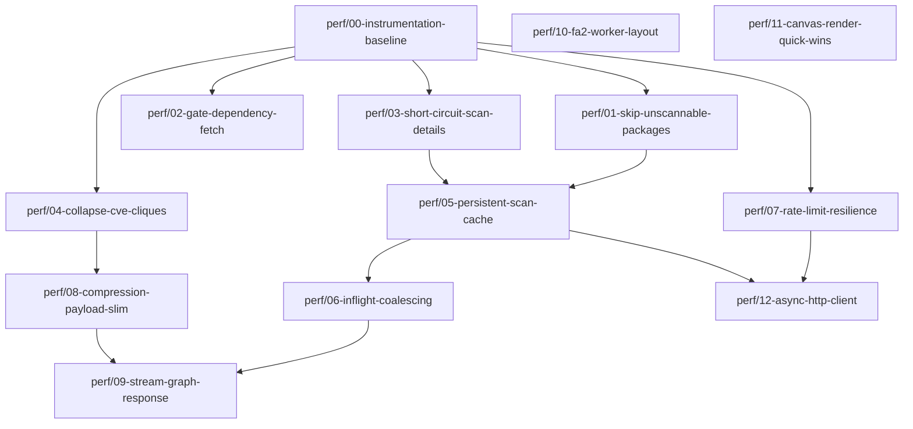

# Forgely — Load Time & Performance Design

| | |
|---|---|
| **Status** | Draft — proposed |
| **Author** | colinmoynes |
| **Date** | 2026-08-03 |
| **Baseline version** | `1.0.0-beta.11` |
| **Target** | Large workspaces load in < 60s cold, < 5s warm |

---

## 1. Problem

On large Cloudsmith workspaces — repositories with several thousand packages — initial graph load takes **5–10 minutes**. During this window the UI shows only a spinner, and a single rate-limit exhaustion can fail the entire request, discarding all completed work.

Three independent bottlenecks contribute, in descending order of impact:

1. **Request volume** — the graph build issues roughly three Cloudsmith API calls per package.
2. **Quadratic edge generation** — shared-CVE edges grow as the square of packages-per-CVE.
3. **Blocking main-thread layout** — ForceAtlas2 runs synchronously in the browser.

This document quantifies each, proposes fixes, and sequences them into independently mergeable branches.

---

## 2. Root cause analysis

### 2.1 Request volume — `~3P` calls for `P` packages

[`_build_graph`](../backend/main.py#L151-L346) issues, for a repository of `P` packages:

| Work | Call count | Source |
|---|---|---|
| Package list pagination | `⌈P/100⌉` | [`fetch_all_packages`](../backend/cloudsmith.py#L224-L238) |
| Vulnerability scan list, one per package | `P` | [main.py:186-198](../backend/main.py#L186-L198) |
| Scan **detail** fetch — fires whenever the list response embeds no vulns, which is the normal case for clean packages | `~P` | [cloudsmith.py:325-334](../backend/cloudsmith.py#L325-L334) |
| Fallback walk over *older* scans when still empty | up to `P × (scans−1)` | [cloudsmith.py:336-349](../backend/cloudsmith.py#L336-L349) |
| Dependencies, one per slug, **ungated by format** | `P` | [main.py:321-333](../backend/main.py#L321-L333) |

**≈ 3P requests minimum.** A 5,000-package repository is ~15,000 HTTP round-trips at 20 workers. At 200ms per call that is a ~2.5 minute network floor before any throttling.

Two aggravating factors:

- **No filtering.** [`_fetch_repo_vuln_summary`](../backend/main.py#L653-L660) already skips packages whose `security_scan_status` contains `"not supported"` or `"awaiting"`. `_build_graph` does not — it reads `scan_status` at [main.py:208](../backend/main.py#L208), *after* paying for the network call.
- **Throttling collapses throughput.** [`_api_get`](../backend/cloudsmith.py#L51-L63) handles 429 with a blocking `time.sleep(retry_after)` *inside a worker thread*. Under sustained rate limiting, all 20 workers park simultaneously — throughput goes to zero rather than degrading gracefully.

### 2.2 Quadratic edge generation

[main.py:303-314](../backend/main.py#L303-L314) emits a complete clique for each CVE: a vulnerability affecting `k` packages produces `k(k−1)/2` edges.

| Packages sharing one CVE | Edges emitted |
|---|---|
| 50 | 1,225 |
| 300 | 44,850 |
| 800 | 319,600 |

A single widely-shared transitive CVE can therefore dominate total payload size, JSON serialisation time, and render cost. On vulnerability-dense repositories this likely exceeds the API-call cost. [The shared-upstream logic at main.py:1070-1083](../backend/main.py#L1070-L1083) has the identical structure over repositories sharing an upstream URL.

### 2.3 Caching is ineffective at this scale

- `CACHE_TTL = 300` ([main.py:73](../backend/main.py#L73)) — **shorter than the load it caches.** A six-minute build is already stale on arrival.
- `_cache` is in-process and unbounded — lost on every restart, grows without eviction.
- No in-flight deduplication: two tabs, or a second click on **Go**, launches two complete concurrent builds at 20 workers each.

### 2.4 Failure handling

After three retries `_api_get` raises `RuntimeError`, which propagates uncaught through `fut.result()` at [main.py:197](../backend/main.py#L197) → HTTP 500. The user loses the entire multi-minute build. `workspace_overview` guards per-repo ([main.py:751-754](../backend/main.py#L751-L754)); `_build_graph` has no equivalent.

### 2.5 Frontend rendering

- [GraphCanvas.tsx:195-208](../frontend/src/components/GraphCanvas.tsx#L195-L208) runs up to 800 FA2 iterations via `forceAtlas2.assign` — **synchronous, main thread**. The tab is frozen for the duration.
- [WorkspaceOverviewCanvas.tsx:52-55](../frontend/src/components/WorkspaceOverviewCanvas.tsx#L52-L55) omits `barnesHutOptimize`, making it `O(N²)` per iteration where the other canvases are `O(N log N)`.
- No `hideEdgesOnMove` on the Sigma constructor ([GraphCanvas.tsx:542](../frontend/src/components/GraphCanvas.tsx#L542)) — pan/zoom is edge-bound on clique-heavy graphs.

### 2.6 Transport

Only CORS middleware is registered ([main.py:64-69](../backend/main.py#L64-L69)). No compression, on a payload that is highly repetitive JSON carrying full CVE descriptions per node.

---

## 3. Design principles

1. **Do not fetch what cannot be used.** Every call must have a plausible chance of returning data.
2. **Immutable data is cached forever.** A completed scan result never changes; only the package list needs a short TTL.
3. **Partial results beat total failure.** A graph missing 2% of scan data is useful; a 500 after eight minutes is not.
4. **Perceived latency is latency.** Streaming first paint changes the experience more than any single throughput gain.
5. **One concern per branch.** Each branch below is independently mergeable and independently revertable.

---

## 4. Tiers

| Tier | Theme | Expected effect |
|---|---|---|
| **0** | Measurement | No user-visible change; establishes the baseline all other claims are checked against |
| **1** | Request-volume reduction | Cold load 3–5× faster |
| **2** | Caching, resilience, transport | Warm load near-instant; eliminates total-failure mode |
| **3** | Frontend rendering | UI stops freezing; pan/zoom smooth at scale |
| **4** | Async rewrite | Deferred — only if measurement shows residual network-bound cost |

> **Sequencing note.** Tier 0 lands first and stays. The estimates in §2 are derived from call structure, not measurement; Tier 0 exists to confirm whether the system is network-bound or rate-limit-bound, because those want different fixes. Do not start Tier 4 before re-measuring after Tier 1.

---

## 5. Branch plan

Branch naming: `perf/<nn>-<slug>`. All branch off `main` unless a dependency is stated.



---

### Tier 0 — Measurement

#### `perf/00-instrumentation-baseline`

**Base:** `main` · **Depends on:** — · **Size:** S · **Risk:** None

Everything downstream is validated against numbers this branch produces. Land it first and keep it.

**Files:** [`backend/cloudsmith.py`](../backend/cloudsmith.py), [`backend/main.py`](../backend/main.py)

**Changes**
- Attach a thread-safe counter to the session object in [`create_session`](../backend/cloudsmith.py#L34-L48). Each build already constructs its own session, so per-build attribution is free.
- Increment in [`_api_get`](../backend/cloudsmith.py#L51-L63), bucketed by endpoint family (`packages`, `vulnerabilities`, `dependencies`, `privileges`, …). Record 429 count and cumulative sleep time separately.
- Log on completion of `_build_graph`, `_build_org_graph`, and `workspace_overview`: wall time, request count per bucket, 429 count, seconds lost to `Retry-After`, node count, edge count, serialised payload bytes.
- Capture `X-RateLimit-Limit` / `X-RateLimit-Remaining` / `X-RateLimit-Reset` response headers into the log line — these determine whether Tier 4 is worth doing at all.
- Add a `?debug=1` query param on `/api/graph` returning the stats block alongside the graph.

**Acceptance criteria**
- One log line per build with the full stats block.
- Baseline recorded for at least one small (<200 pkg), one medium (~1k), and one large (5k+) repository. **Commit these numbers to this document in §8.**

**Also records** the data needed to build the format list in `perf/02` — log which package formats ever return a non-empty dependency array.

---

### Tier 1 — Request-volume reduction

#### `perf/01-skip-unscannable-packages`

**Base:** `main` · **Depends on:** `perf/00` (for verification) · **Size:** S · **Risk:** Low–Medium

**Files:** [`backend/main.py`](../backend/main.py)

**Changes**
- In the `pkg_metas` construction loop ([main.py:171-184](../backend/main.py#L171-L184)), add a `scannable` flag derived from `pkg["security_scan_status"]`, mirroring [main.py:653-660](../backend/main.py#L653-L660).
- Submit **only** scannable metas to the ThreadPoolExecutor ([main.py:194-198](../backend/main.py#L194-L198)). Seed `vuln_results[node_id] = (None, 0, [])` for the rest, so the node-building loop at [main.py:200](../backend/main.py#L200) is untouched.

> ### 🛑 Unscannable packages must still appear in the graph
>
> **`pkg_metas` must not be filtered.** `_build_graph` iterates it twice — once to submit vulnerability fetches ([main.py:194-198](../backend/main.py#L194-L198)) and once to build nodes ([main.py:200](../backend/main.py#L200)). This branch narrows **only the first**. Every package keeps its node and its `repo_package` edge.
>
> **Do not copy the filter shape from [`_fetch_repo_vuln_summary`](../backend/main.py#L653-L660).** That function `continue`s out of its loop, which is correct there because it only accumulates counters — but in `_build_graph` the same `continue` would delete the node. This is the likely implementation error; reviewers should check for it specifically.
>
> Rendering path, unchanged by this branch: `max_severity: null` → `sev = "Unknown"` ([GraphCanvas.tsx:448](../frontend/src/components/GraphCanvas.tsx#L448)) → grey node, visible by default. Users can opt to hide them via the `hideUnsupported` toggle, which defaults to `false` ([App.tsx:47](../frontend/src/App.tsx#L47)). Stats accounting is also unchanged — `None` is not a key in `stats`, so these packages continue to fall through to `stats["Safe"]`.

**⚠ Behaviour decision required.** The two skip conditions are not equivalent:

| Status | Skipping is | Rationale |
|---|---|---|
| `"not supported"` | **Behaviour-neutral** | `(None, 0, [])` flows into the `"not supported" in scan_status` branch at [main.py:225-228](../backend/main.py#L225-L228), preserving `max_sev = None` → grey. Identical output. |
| `"awaiting"` | **Behaviour-changing** | Falls through to the `else` at [main.py:229-234](../backend/main.py#L229-L234), which forces `"Scanned (Clean)"` / green. A pending package would render as clean. |

Recommendation: skip `"not supported"` in this branch. Handle `"awaiting"` separately by introducing a distinct *pending* node state (amber/hatched) rather than silently colouring it green — a security tool should not present "not yet scanned" as "clean". That is a UX change and belongs in its own branch.

**Acceptance criteria**
- **`total_nodes` and `total_edges` unchanged from `main`** on a repository containing unsupported formats. This is the primary gate — if node count drops, the branch is wrong.
- Every unsupported-format package still renders as a grey node with `hideUnsupported` off.
- Request count for `vulnerabilities` bucket drops by the proportion of unsupported-format packages.
- Graph output byte-identical to `main` on a repository with mixed formats (diff the JSON).

**Expected impact:** Large on repositories with docker/raw/deb content; negligible on pure npm/PyPI.

---

#### `perf/02-gate-dependency-fetch`

**Base:** `main` · **Depends on:** `perf/00` (supplies the format list) · **Size:** S · **Risk:** Low

**Files:** [`backend/cloudsmith.py`](../backend/cloudsmith.py), [`backend/main.py`](../backend/main.py)

**Changes**
- Add a `DEPENDENCY_FORMATS: frozenset[str]` constant to `cloudsmith.py`, alongside the existing [`UPSTREAM_FORMATS`](../backend/cloudsmith.py#L193-L197).
- Gate the submission loop at [main.py:322](../backend/main.py#L322) on the package's `format`.
- Deduplicate by `node_id` before submitting — `slug_to_id` holds one entry per `slug_perm`, so name@version collisions currently produce redundant fetches writing to the same `src_id`.

> **Populate `DEPENDENCY_FORMATS` from the Tier 0 logs, not from assumption.** Start from the formats observed to return non-empty dependency arrays; treat the constant as a denylist-by-omission and note that adding a format is a one-line change. Formats that always 404 or return `[]` are pure waste today — each costs a round-trip and a warning log in [`fetch_dependencies`](../backend/cloudsmith.py#L241-L249).

**Acceptance criteria**
- `dependencies` request bucket drops to the count of dependency-bearing packages.
- No dependency edge present on `main` is missing after the change (diff edge sets on a multi-format repo).

**Expected impact:** Up to one third of all requests eliminated.

---

#### `perf/03-short-circuit-scan-details`

**Base:** `main` · **Depends on:** `perf/00` · **Size:** M · **Risk:** **Medium — highest correctness risk in Tier 1**

**Files:** [`backend/cloudsmith.py`](../backend/cloudsmith.py)

**Changes to [`get_package_vulnerabilities`](../backend/cloudsmith.py#L308-L387)**
- After selecting `latest` and reading `api_count`, return early with `("None", 0, [])` when `api_count == 0` **and** `max_severity` is absent or in `("None", "Unknown")`. This skips the detail fetch for every clean package — the dominant case.
- Cap the historical-scan fallback loop ([cloudsmith.py:336-349](../backend/cloudsmith.py#L336-L349)) at **one** additional scan. It is currently unbounded: a package with ten historical scans can issue nine extra detail calls.

**Risk.** If the Cloudsmith list endpoint does not reliably populate `num_vulnerabilities`, early return would mask real vulnerabilities — a false-negative in a security tool. This must be validated, not assumed.

**Acceptance criteria** *(stricter than other branches — this one can hide findings)*
- On a repository with known vulnerable packages, the full graph JSON is **byte-identical** to `main` for all `max_severity`, `vuln_count`, and `cves` fields.
- Explicitly verify at least one package where the list response reports `num_vulnerabilities > 0` but embeds no vuln array — confirm the detail fetch still fires.
- Log a `WARNING` when a scan reports `num_vulnerabilities == 0` but a detail fetch would have returned vulns; run with the short-circuit disabled via env flag for one cycle to confirm the count is zero.

**Expected impact:** Roughly halves total request count.

---

#### `perf/04-collapse-cve-cliques`

**Base:** `main` · **Depends on:** `perf/00` · **Size:** L · **Risk:** Medium — visual change

**Files:** [`backend/main.py`](../backend/main.py), [`frontend/src/types/index.ts`](../frontend/src/types/index.ts), [`frontend/src/components/GraphCanvas.tsx`](../frontend/src/components/GraphCanvas.tsx), [`frontend/src/components/FilterBar.tsx`](../frontend/src/components/FilterBar.tsx), [`frontend/src/components/Legend.tsx`](../frontend/src/components/Legend.tsx)

Three viable approaches. **Decide before starting** — they differ materially in blast radius.

| | **A — CVE hub nodes** | **B — Client-derived cliques** | **C — Cap clique size** |
|---|---|---|---|
| Backend emits | `cve:<id>` node + `k` edges | nothing | clique if `k ≤ N`, else hub |
| Payload | `O(k)` | `O(1)` | bounded |
| Frontend change | new node type, legend, reducers | derive adjacency from `node.data.cves` | minimal |
| Visual change | **Significant** — new node class | none | only on large CVEs |
| Effort | High | Medium | **Low** |

**Recommendation: C for this branch, A as a follow-up if the visualisation proves better.** C removes the pathological case with minimal risk and no design debate; A is arguably the better long-term model (a CVE genuinely *is* an entity in a security graph) but is a product decision, not a performance one.

Note that the frontend already derives a `sharedCveNodes` set from edges at [GraphCanvas.tsx:327-336](../frontend/src/components/GraphCanvas.tsx#L327-L336). Under option B this set would be built from each node's `data.cves` array instead — the data is already present client-side, so the backend need not ship these edges at all. The blocker for B is that shared-CVE edges are also *rendered* ([GraphCanvas.tsx:826](../frontend/src/components/GraphCanvas.tsx#L826)), so removing them entirely is a visual regression unless the client materialises them locally.

**Apply the same fix to [`shared_upstream`](../backend/main.py#L1070-L1083)** in `_build_org_graph` — identical quadratic structure over repositories sharing an upstream URL.

**Acceptance criteria**
- Edge count on the worst-case repository drops by the expected factor; record before/after in §8.
- All eight `shared_cve` call sites in `GraphCanvas.tsx` still behave correctly — the FilterBar toggle, search highlighting, and hide-edges toggle in particular.

**Expected impact:** Potentially the single largest payload and render win on vulnerability-dense repositories.

---

### Tier 2 — Caching, resilience, transport

#### `perf/05-persistent-scan-cache`

**Base:** `main` · **Depends on:** `perf/01`, `perf/03` · **Size:** L · **Risk:** Medium

**Files:** [`backend/main.py`](../backend/main.py), [`backend/cloudsmith.py`](../backend/cloudsmith.py), new `backend/cache.py`, [`backend/requirements.txt`](../backend/requirements.txt)

**Changes**
- New `backend/cache.py` wrapping SQLite (stdlib — no new dependency required; prefer this over `diskcache` unless concurrency demands it).
- Key scan results on `(owner, repo, slug_perm, scan_identifier)`. **These are immutable** — a completed scan never changes — so TTL can be effectively infinite. Only new packages and new scans cost network.
- Keep the package *list* on a short TTL (5–10 min); it is the only volatile input.
- Raise `CACHE_TTL` ([main.py:73](../backend/main.py#L73)) for assembled graphs, or drop the in-memory graph cache entirely once the scan-level cache makes rebuilds cheap.
- Add cache hit/miss counters to the Tier 0 stats block.

**Acceptance criteria**
- Second load of an unchanged 5k-package repository completes in < 5s.
- Cache survives backend restart.
- Adding one package to a cached repository fetches exactly one scan.

**Note:** the existing `_cache` dict is unbounded and holds full `GraphResponse` objects for every repo plus workspace overviews. Add eviction here or drop it.

---

#### `perf/06-inflight-coalescing`

**Base:** `main` · **Depends on:** `perf/05` · **Size:** S · **Risk:** Low

**Files:** [`backend/main.py`](../backend/main.py)

Maintain `dict[cache_key, Future]` guarded by a lock. Concurrent callers for the same key await the same build rather than launching a second one. Applies to `/api/graph` ([main.py:349-367](../backend/main.py#L349-L367)), `/api/workspace-overview` ([main.py:721](../backend/main.py#L721)), and `/api/org-graph` ([main.py:1102](../backend/main.py#L1102)).

**Acceptance criteria:** two simultaneous requests for the same repo produce one set of upstream API calls, verified via the Tier 0 counter.

---

#### `perf/07-rate-limit-resilience`

**Base:** `main` · **Depends on:** `perf/00` · **Size:** M · **Risk:** Low

**Files:** [`backend/cloudsmith.py`](../backend/cloudsmith.py), [`backend/main.py`](../backend/main.py)

**Changes**
- **Isolate per-package failure.** Wrap `fut.result()` at [main.py:197](../backend/main.py#L197) and [main.py:324](../backend/main.py#L324) in try/except, mirroring the guard already present at [main.py:751-754](../backend/main.py#L751-L754). Degrade to partial data; never lose a completed build to one failed package.
- **Surface partial results.** Add a `partial: bool` and `failed_count: int` to `GraphResponse` ([backend/models.py](../backend/models.py)) so the UI can warn rather than silently under-report vulnerabilities. **This matters** — a security graph that quietly omits packages is worse than one that says so.
- **Pace proactively.** Replace reactive 429 handling with a shared token bucket seeded from `X-RateLimit-Remaining` / `X-RateLimit-Reset`. Currently all 20 workers park in `time.sleep` simultaneously ([cloudsmith.py:55-60](../backend/cloudsmith.py#L55-L60)); pacing before the limit avoids the stall entirely.
- Raise `MAX_RETRIES` from 3 and add jitter, now that failure is non-fatal.

**Acceptance criteria**
- A forced 429 storm yields a partial graph with an accurate `failed_count`, not a 500.
- Seconds-lost-to-`Retry-After` in the Tier 0 stats drops materially on a large workspace.

---

#### `perf/08-compression-payload-slim`

**Base:** `main` · **Depends on:** `perf/04` · **Size:** M · **Risk:** Low

**Files:** [`backend/main.py`](../backend/main.py), [`backend/models.py`](../backend/models.py), [`frontend/src/components/SidePanel.tsx`](../frontend/src/components/SidePanel.tsx)

- Register `GZipMiddleware` alongside CORS ([main.py:64-69](../backend/main.py#L64-L69)) with `minimum_size=1000`. One line; expect 5–10× reduction on this payload shape.
- Drop `description` from `CVERecord` in the graph payload and lazy-load on node click via a new `/api/cve/{owner}/{repo}/{slug}` endpoint. Descriptions are long, repeated across packages sharing a CVE, and invisible until a node is selected.

**Acceptance criteria:** transfer size for the largest repo recorded before/after in §8; SidePanel still shows full descriptions on click.

---

#### `perf/09-stream-graph-response`

**Base:** `main` · **Depends on:** `perf/06`, `perf/08` · **Size:** L · **Risk:** Medium

**Files:** [`backend/main.py`](../backend/main.py), [`frontend/src/hooks/useGraphData.ts`](../frontend/src/hooks/useGraphData.ts), [`frontend/src/components/LoadingIndicator.tsx`](../frontend/src/components/LoadingIndicator.tsx), [`frontend/src/components/GraphCanvas.tsx`](../frontend/src/components/GraphCanvas.tsx)

Convert `/api/graph` to NDJSON over `StreamingResponse`: emit the repo node and all package nodes immediately (available from the package-list call alone), then vulnerability data as futures resolve, then dependency edges, then a final stats frame.

[`useGraphData`](../frontend/src/hooks/useGraphData.ts#L19-L27) currently awaits `resp.json()` in one shot; rewrite to read the stream and update incrementally. `LoadingIndicator` becomes a real progress bar.

**This does not make the load faster — it makes it *feel* dramatically faster.** First paint in ~2s instead of a multi-minute spinner. Defer the layout run until the node set is complete, or use the Tier 3 worker supervisor so nodes visibly settle as they arrive.

**Optional: risk-first ordering via `vulnerability_policy_violated`.** Per open question #1, a single query returns every package breaching the org's vulnerability policy. Issue that query up front and scan those packages first, so the highest-risk nodes resolve within seconds rather than at a random point in the stream. Strictly a *scheduling* optimisation — the remaining packages must still be scanned exhaustively, because the predicate reflects only the configured policy threshold and returns nothing where no policy exists. Never use it to decide what to skip.

**Acceptance criteria:** first nodes painted within 3s on a 5k-package repository; progress indicator monotonic; abort on navigation cancels the backend build.

---

### Tier 3 — Frontend rendering

Independent of all backend work; can be developed in parallel by a second person.

#### `perf/10-fa2-worker-layout`

**Base:** `main` · **Depends on:** — · **Size:** M · **Risk:** Low

**Files:** [`GraphCanvas.tsx`](../frontend/src/components/GraphCanvas.tsx), [`OrgGraphCanvas.tsx`](../frontend/src/components/OrgGraphCanvas.tsx), [`WorkspaceOverviewCanvas.tsx`](../frontend/src/components/WorkspaceOverviewCanvas.tsx)

Replace synchronous `forceAtlas2.assign` with `FA2LayoutSupervisor` from `graphology-layout-forceatlas2/worker`. **Already present in `node_modules`** — verified at `node_modules/graphology-layout-forceatlas2/worker.js`; no dependency change needed.

Run for a bounded duration or until convergence, then `kill()`. Ensure the supervisor is stopped on unmount and on layout switch. Preserve the existing radial pre-placement ([GraphCanvas.tsx:174-193](../frontend/src/components/GraphCanvas.tsx#L174-L193)) and the post-layout re-anchoring of the repo node to origin ([GraphCanvas.tsx:210-215](../frontend/src/components/GraphCanvas.tsx#L210-L215)).

**Acceptance criteria:** main thread never blocks > 50ms during layout; no supervisor leaks across layout switches (check with repeated toggling).

---

#### `perf/11-canvas-render-quick-wins`

**Base:** `main` · **Depends on:** — · **Size:** XS · **Risk:** Very low

**Files:** [`WorkspaceOverviewCanvas.tsx`](../frontend/src/components/WorkspaceOverviewCanvas.tsx), [`GraphCanvas.tsx`](../frontend/src/components/GraphCanvas.tsx)

- Add `barnesHutOptimize: true` at [WorkspaceOverviewCanvas.tsx:52-55](../frontend/src/components/WorkspaceOverviewCanvas.tsx#L52-L55). It is the only canvas missing it — currently `O(N²)` per iteration across up to 600 iterations. `adjustSizes: true` is compatible; the installed implementation honours it inside the Barnes-Hut branch (verified in `iterate.js`).
- Add `hideEdgesOnMove: true` to the Sigma constructor at [GraphCanvas.tsx:542](../frontend/src/components/GraphCanvas.tsx#L542).

Two lines, no behavioural risk. Could reasonably be the first thing merged.

---

### Tier 4 — Deferred

#### `perf/12-async-http-client`

**Base:** `main` · **Depends on:** `perf/05`, `perf/07` · **Size:** XL · **Risk:** High

**Do not start before re-measuring after Tier 1 and 2.**

Convert `cloudsmith.py` from `requests` to `httpx.AsyncClient` with an `asyncio.Semaphore`, and convert the FastAPI endpoints from `def` to `async def`. Twenty threads is near the practical ceiling for blocking I/O in a sync endpoint (which occupies one of FastAPI's default 40 threadpool slots for the entire build); async allows 100+ concurrent requests at a fraction of the memory.

**This is only worth doing if measurement shows residual network-bound cost.** If Tier 0 shows you are rate-limit-bound rather than concurrency-bound, higher concurrency achieves nothing — it just hits the ceiling faster. Decide from the data.

---

## 6. Suggested merge order

| # | Branch | Why here |
|---|---|---|
| 1 | `perf/00-instrumentation-baseline` | Everything else is validated against it |
| 2 | `perf/11-canvas-render-quick-wins` | Two lines, zero risk, immediate benefit |
| 3 | `perf/01-skip-unscannable-packages` | Largest safe request cut |
| 4 | `perf/02-gate-dependency-fetch` | Independent, low risk |
| 5 | `perf/03-short-circuit-scan-details` | Highest reward, needs the most careful verification |
| 6 | `perf/04-collapse-cve-cliques` | Payload and render |
| — | **Re-measure. Reassess the remaining tiers against real numbers.** | |
| 7 | `perf/07-rate-limit-resilience` | Removes the total-failure mode |
| 8 | `perf/05-persistent-scan-cache` | Warm loads |
| 9 | `perf/06-inflight-coalescing` | Small, depends on cache |
| 10 | `perf/08-compression-payload-slim` | Transport |
| 11 | `perf/10-fa2-worker-layout` | Can land any time; parallel track |
| 12 | `perf/09-stream-graph-response` | Largest UX gain, benefits from everything above |
| 13 | `perf/12-async-http-client` | Only if data justifies it |

---

## 7. Verification protocol

Every branch reports, against the Tier 0 baseline, on the **same three repositories**:

- Total API calls, by endpoint bucket
- Wall-clock build time (cold / warm)
- 429 count and seconds lost to `Retry-After`
- Node count, edge count, serialised payload bytes
- Longest main-thread block (Tier 3 branches)

**Correctness gate for every backend branch:** the graph JSON must be diffed against `main` on a repository with known vulnerabilities. Severity counts, CVE identifiers, and `vuln_count` must be unchanged unless the branch explicitly documents the change. Forgely is a security tool — a performance change that quietly drops a finding is a defect, not a trade-off.

---

## 8. Measurements

*To be populated by `perf/00-instrumentation-baseline` and updated by each branch.*

| Repo | Packages | Baseline time | Baseline calls | Baseline edges | Baseline bytes |
|---|---|---|---|---|---|
| _small_ | | | | | |
| _medium_ | | | | | |
| _large_ | | | | | |

---

## 9. Open questions

1. ~~**Does the Cloudsmith package-list API expose a bulk vulnerability filter?**~~ — **RESOLVED: No.** ✅

   Checked against [Search, filter and sort packages](https://docs.cloudsmith.com/artifact-management/search-filter-sort-packages) (2026-08-03). The query syntax supports `name`, `filename`, `tag`, `version`, `prerelease`, `architecture`, `distribution`, `format`, `status`, `checksum`, `downloads`, `type`, `size`, `uploaded`, `last_downloaded`, `token`, `dependency`, `repository`, format-specific terms (`deb_component`, `docker_image_digest`, `docker_layer_digest`, `maven_group_id`), and four policy predicates. **There is no filter for severity, CVE identifier, vulnerability count, or security scan status.**

   Two clarifications that matter for this plan:
   - `status:` is *package* status (e.g. `in_progress`) — upload/sync state, not `security_scan_status`. It cannot substitute for the filter in `perf/01`.
   - `dependency:log4j` searches for packages *having* a given dependency. It does not bulk-return a package's dependency list, so it does not help `perf/02`.

   **Consequence: Tier 1 stands as designed.** No branches are invalidated; there is no bulk shortcut to collapse `perf/01`–`perf/03`. Proceed as written.

   **One salvageable lead** — `vulnerability_policy_violated:true` returns, in a single query, every package tripping the org's configured vulnerability policy. This is *not* a severity filter and cannot replace per-package scanning: it only catches packages breaching the configured threshold, so a Critical-only policy would miss all High/Medium/Low findings, and it returns nothing at all where no policy is configured. It is therefore useless for completeness — but it is an excellent **prioritisation** signal. See `perf/09`.
2. **What is the actual rate limit for the target accounts?** Determines whether Tier 4 has any value. Answered by Tier 0.
3. **Should `"awaiting"` packages render distinctly?** See the behaviour decision in `perf/01`. Currently they would silently become green.
4. **Is the CVE-as-node model (option A in `perf/04`) desirable as a product change**, independent of performance?
5. **Multi-worker deployment?** `start.sh` runs a single uvicorn process. A persistent cache (`perf/05`) is a prerequisite for scaling out, since `_cache` is per-process.

---

## Appendix — branch creation

```bash
# Tier 0
git checkout main && git pull
git checkout -b perf/00-instrumentation-baseline

# Tier 1
git checkout main && git checkout -b perf/01-skip-unscannable-packages
git checkout main && git checkout -b perf/02-gate-dependency-fetch
git checkout main && git checkout -b perf/03-short-circuit-scan-details
git checkout main && git checkout -b perf/04-collapse-cve-cliques

# Tier 2
git checkout main && git checkout -b perf/05-persistent-scan-cache
git checkout main && git checkout -b perf/06-inflight-coalescing
git checkout main && git checkout -b perf/07-rate-limit-resilience
git checkout main && git checkout -b perf/08-compression-payload-slim
git checkout main && git checkout -b perf/09-stream-graph-response

# Tier 3
git checkout main && git checkout -b perf/10-fa2-worker-layout
git checkout main && git checkout -b perf/11-canvas-render-quick-wins

# Tier 4
git checkout main && git checkout -b perf/12-async-http-client
```

Branches with stated dependencies should be rebased onto their parent once it merges, rather than branched from `main` at creation time.
